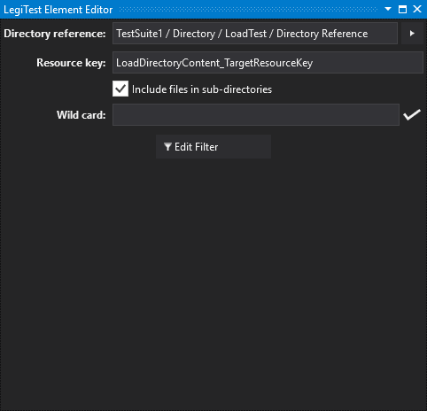



# Load Directory Content

The load directory content action loads the content of a directory into a grid. This can be useful for verifying that a list of files matches an expected set, or for use within [data driven testing](DataDrivenTesting.md) to allow a test to be run for each file in a directory.

**Directory reference -** This is the [directory reference asset](DirectoryReference.md) that stores the path to the directory to load. Click on the arrow to select the asset to use.

**Resource key -** This is the resource key of the grid that will be loaded.

**Include files in sub-directories -** Tick this to load files in sub-directories as well as the selected path.

**Wild card -** This is the wild card used to select files - it could be of the form '*.txt' or 'Report*.*'. For more complicated restrictions, use the filter.

**Edit filter -** Use this button to edit the filter of files to load. For more information about filtering, please see the filtering topic.