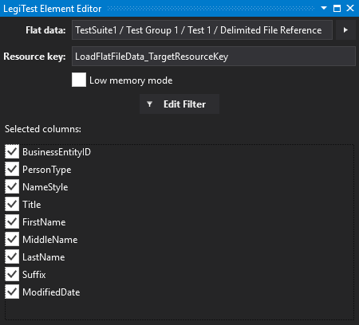



# Load Flat File Data

The load flat file data action will load flat file data into a resource key for comparison / validation.

The load flat file data action loads data from the following types of asset:

- [Delimited File Reference](DelimitedFileReference.md)

- [Delimited Content](DelimitedContent.md)

- [Fixed Width File Reference](FixedWidthFileReference.md)

#### Load Flat File Data Editor

**Flat data -** The [Delimited File Reference Asset](DelimitedFileReference.md), [Delimited Content Asset](DelimitedContent.md) or [Fixed Width File Reference Asset](FixedWidthFileReference.md) that contains the information about the file to load.

**Resource Key -** Name of the resource key to store the results in.

**Low memory mode -** If true, then the grid is loaded in low memory mode - meaning that the data is stored in a temporary file.

**Edit Filter -** Pressing this button will bring up the [filtering window](Filtering.md) that allows a SQL-like filter expression to be applied to select data.

**Selected columns -** This area allows the user to select which columns will be loaded from the flat file data.