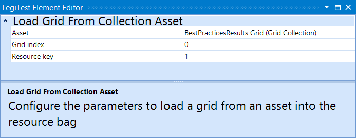



# Load Grid From Asset

The load grid from asset action will load the grid defined by a grid collection asset into a resource key for comparison.

#### Load Grid Editor

**Asset -** The Grid Collection asset to be used.

**Grid Index -** The index of the grid to be loaded into the resource key. Default is 0.

**Resource Key -** Name of the resource key to store the results in.