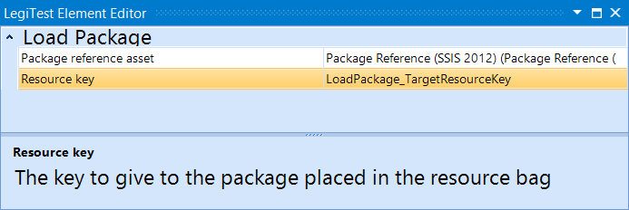



# Load Package

The load package prepares a package from a package reference asset and gives it a resource key to be used in another element.

**Package Reference Asset -** The package asset previously defined.

**Resource Key -** Where the package is stored, the name is used to select the package in the execute package element.