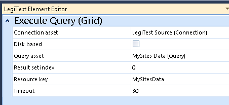

# My First SSIS LegiTest


In the previous post, “Designing a LegiTest Test”, we walked through the steps to design a test around an SSIS package. In this post we’ll build our first LegiTest test, allowing us to test the execution of an SSIS Package. If you haven’t read the previous post Designing a LegiTest Test you should, as it establishes the design we will implement here.


After creating a solution / project for the package described in the previous post, we’ll add a second project.  Add the second project by going to the menu and doing File, Add, New Project. In the Add New Project dialog, click on Visual C#, scroll down and click “LegiTest Project – MSTest”. Give it a good name and click OK.


As a reminder, in the previous post, the basic steps for design were:


1. Understand the object being tested.

2. Identify the assertions which will legitimize the object being tested.

3. Define the actions that need to be taken in order to do the tests.

4. List the assets needed in order for the actions to work.


Implementing the design goes in reverse order.

1. Create the assets.

2. Define the actions.

3. Create the asserts.


### Assets


As the first step to building our test, we’ll start creating assets.


### Connections


Click inside the Assets area. The LegiTest Toolbox will update with the items appropriate to the assets area. In the toolbox, click on the Connection tool, drag and drop it into the assets area.  


Click on the Connection block, and the LegiTest Element Editor should appear. In the provider drop down, pick the SqlClient Data Provider. Take a second though to note the vast array of data connections available, including Oracle, OLEDB and ODBC.


Next click on the Configure button. This will bring up a dialog you’ve likely seen a million times in your career as a data centric developer. Use it to select the server and the LegiTestSource database. Also be sure to set the user ID correctly, for a simple test to localhost the Windows Authentication option will likely work fine.


Finally rename the asset to LegiTest Source, either by single clicking twice or right clicking and picking rename on the popup menu. When done it will look something like the image below.


Don’t be alarmed about the big exclamation mark in the upper right corner. That’s just an indicator that it is an asset that isn’t being used. In this case, the asset isn’t being used yet.


Now repeat the above steps, creating a connection to the LegiTestDestination database. You can name it LegitTest Destination (spaces OK, it just makes the name easier to read). As an alternative to drag and drop from the toolbox, try right clicking in the asset area, and in the popup menu pick Query, Connection.


### Queries


To meet our requirements four queries will be needed. From the toolbox, drop a Query tool into the assets area. The element area for a query is pretty simple, just a big text box. In it paste the following query:


```sql
SELECT COUNT(*) AS MySitesCount

 FROM [dbo].[MySites]
```


Name the query asset MySites Count.


Now repeat the process, creating another query asset named DimMySites Count and using the following query:


```sql
SELECT COUNT(*) AS DimMySitesCount

 FROM [dbo].[DimMySites]
```


Next, in order to do the data compare we need queries to bring back the rows and columns from the source and target. Add a query MySites Data, with this query:


```sql
SELECT [PrimaryKey], [Name], [URL]

 FROM [dbo].[MySites]

ORDER BY [PrimaryKey]
```


And then another query, DimMySites Data, with this query:


```sql
SELECT [PrimaryKey], [Name], [URL]

 FROM [dbo].[DimMySites]

ORDER BY [PrimaryKey]
```


Note the Order By clause, it is needed to make sure the rows are in the correct order for the compare. Also note the LastUpdate is omitted from the DimMySites Data query. The source system lacks this field, thus we’d have nothing to compare to if it was included.


But wait, you say, wasn’t there a requirement to check the LastUpdate to ensure the row hadn’t changed? Good catch. However, instead of handling it as part of the data compare we will instead use a scalar comparison to get the value prior to and after the package executes and use those to compare. For that we need to add another query asset DimMySites LastUpdate. For the query use:


```sql
SELECT [LastUpdate]

 FROM [dbo].[DimMySites]

WHERE [Name] = 'Pragmatic Works'
```


Note you could also have used the primary key, however in most data warehousing situations the primary key is usually the surrogate key, which may not be predictable. In this example we went with the Name column, which acts as the source system native key for this demo.


We’re almost done. Even though it wasn’t mentioned as a requirement, one thing every test needs is a way to reset the target before each run. This can be accomplished in a variety of ways. For example, LegiTest has a backup / restore asset which would allow you to restore the destination database from a baseline database previously backed up. You could also use the Execute Process task to deploy a dacpac to the target.


In this case though we can do something much simpler. We’ll add a query to truncate the target table, then insert the needed rows. Create a query DimMySites Reset. Insert the following code:


```sql
TRUNCATE TABLE [dbo].[DimMySites];


INSERT INTO [dbo].[DimMySites]

 ([PrimaryKey], [Name], [URL])

VALUES

  (1, 'Pragmatic Works', 'http://pragmaticworks.com')

 , (3, 'arcanecode', 'http://arcanecode.com')

 ;
```


Important point to note about the above query. If you ran this in SQL Server Management Studio, it would want a GO after the TRUNCATE TABLE statement. GO is a mechanism for SSMS, it is not needed when executing a query from a .Net application such as LegiTest generates. Be sure to omit any GOs or else you will get an incorrect syntax error when you execute your test.


That is the last of the query assets we need to create. However, there are two more asset we need to add before we can begin creating our actions.


### Comparison Manifest


In order for LegiTest to be able to compare data sets, or as the toolbox calls them grids, it needs to know how each column from the first data set (referred to as the Left Side) compares to the columns on the Right Side.


Insert a Comparison Manifest tool into the assets area. Name it Compare MySites to DimMySites. In the LegiTest Element Editor, you will see the first step of the Comparison Manifest wizard appear, titled Gather Left Column(s). To this you will first need to provide a connection. Click the Copy From Asset button, in the dialog that appears click on the LegiTest Source (Connection) then click OK.


Note that if you had not yet created the connection you could also do it through this dialog. However, because you are a talented and brilliant individual (you must be if you’re using LegiTest) and planned things ahead, the connections already exist and can just be picked.


Next the Comparison Manifest needs to know the query that will get the data for the left side. Simply click the Copy From Asset button next to the Query, and select the MySites Data (Query) in the dialog that appears. When done your editor should look approximately like the image below.


Click the Gather button to proceed to the next step. Now we repeat the steps for the right side. For the Connection, copy from the asset LegitTest Destination, and for the query copy from DimMySites Data. When done click Gather.


In the final page of the wizard we need to match up the columns. LegiTest automatically matches when the names are the same, which is a great reason to use aliasing in the queries if you can. In this simple demo it wasn’t needed as the column names all matched up.


If it was, you could click on a column name, slick the edit button to the right, and change the mapping. You can also add mappings if LegiTest didn’t detect it, or delete ones you don’t want to compare.


There is one thing we can do to help speed things along. Note the Key Columns area at the top is empty. We should move the PrimaryKey column up to this area to speed up the compare.


First, click the Add button at the top, next to the Key Columns. In the page that appears, pick the PrimaryKey for both the left and right column name and click OK.


Next, in the Comparison Columns area, click on the PrimaryKey and then the Delete button. Since we’ve indicated it is the primary key, it isn’t going to change and hence doesn’t need to be compared. Your compare should now look like:


### Package Reference (SSIS 2012)


The final item to add is a reference to the package we are testing. Click in the Assets area, then into it drag and drop a Package Reference (SSIS 2012) asset from the toolbox. In the LegiTest Element Editor, there are three locations to load the package from: File, SQL, and Catalog. For this example the File option will be selected, however many opt to run from the catalog to make testing from multiple machines easier.

Make sure File is selected (it will be a darker color than the others) the click the Browse button. Navigate to the folder with your package and select it.


Finally give the asset a good name, in this case just name it after the package, MyFirstSSISLegiTest


Now that we’ve finished creating the assets, take a second to save your work, then it’s time to start the action rolling!


### Actions


Now that all the assets are setup, it’s time to create the actions. Actions are arranged at multiple levels. To fully understand how LegiTest organizes tests, please refer to the first post in the series, “Introduction to the LegiTest Designer”.


### Group Level Actions


With the assets setup, move to the arrangement area in the designer, and click on Test Group 1. Rename it to DimMySites Package. Now in the Group Initialization Steps area, we need to perform actions that are needed prior to testing.


Referring back to our requirements, there were three actions that needed to be performed prior to doing any testing. The first action was “reset the target table to a known state”. To do so we will execute the DimMySites Reset query. In the LegiTest Toolbox, drag an “Execute Query (Command)” action into the Group Initialization Steps area. Click on it to open the LegiTest Element Editor.


Click in the Connection Asset area, then click on the … icon. In the dialog that appears select the LegiTest Destination connection asset you setup. Next, repeat the process for the Query Asset, selecting the DimMySites Reset (Query) asset. (Note you may need to click outside the line with Query Asset to make it finalize your choice). Finally, rename the action to “Exec DimMySites Reset”.


Now that the target table has been reset, we need to get a key piece of information from the table. For the row that is not supposed to change (the row with “Pragmatic Works” in the Name column), we will get the LastUpdate column before the package executes. Later, we’ll compare this to the LastUpdate column after the package runs to ensure there was no change.


Into the Group Initialization Steps, place an Execute Query (Scalar) action. For the Connection select the LegiTestDestination, for the Query select DimMySites LastUpdate.


The only other option is Resource Key. Most (but not all) actions in LegiTest have a Resource Key. Think of the Resource Key much like a variable. When an action has some output, the output is stored in the Resource Key, where it can be later accessed by other actions. Thus you should be sure to give all Resource Key’s good, clear names.


In this case, the LastUpdate value retrieved by the query will be stored in the Resource key we provide. As you can see from the image above, we’ll name this DimMySitesLastUpdatePreRun. As the last step rename the action to “Exec DimMySites LastUpdate Pre Run”.


The third action in our list of things to do is “Load the package into memory”. This is straightforward. From the toolbox, simply drag the Load Package action to the Group Initialization Steps. In the LegiTest Element Editor, in the Package Reference Asset pick the MyFirstSSISLegiTest asset from the dialog.


At last we are at the final action needed for our tests, and that is to run the package. From the toolbox drop an Execute Package action into the Group Initialization Steps area. In the LegiTest Element Editor, select the MyFirstSSISLegiTestPackage (Package) from the dialog. This came from the Load Package assets Resource Key name in the previous step.


Speaking of resource keys, we should give this one a good name, how about ExecMyFirstSSISLegiTest. Finally rename the asset itself Exec MyFirstSSISLegiTest.


The Group Initialization Steps track should now look like:


### Actions and Asserts – The Tests


Now that the group level actions are done, it is time to build each test. In each test we first build the actions to get back any further data needed to do our asserts, then we build the asserts themselves.


### For this example we have five tests to perform.


### Test One – Row Counts


At long last it is time to setup the first test. If you recall from the initial requirements, test one is to “Test to ensure that the source and target tables have the same number of rows after the package executes.”


Click on the Test 1 in the arrangement pane. By using the same single click twice method used on assets and actions, tests can also be renamed. In this example we can use the name of the group followed by the test. DimMySites_RowCounts will make a good name.


Why? Well when tests are executed, all tests across all projects in the solution are lumped together and only the test name, not the test group, will be visible. Depending on the number of tests in your project, a simple name like “Row Counts” won’t be sufficient enough to quickly identify and find the test should it fail.


For an especially large project you may wish to extend your naming scheme even further, for example Project_Group_TestName. Also note that when the tests are compiled, any spaces are removed thus an underscore may make your test names more readable.


To fulfill this requirement, we need to match the rows in the source to the rows in the target. Thus we’ll need to execute the two row count queries stored in the assets area, then compare the results.


Begin by dropping an Execute Query (Scalar) action into the Execution Tracks area. These actions are used to run queries that return a single value, such as a SELECT COUNT or executing a stored procedure which returns a single value.


In the LegiTest Element Editor, for the Connection Asset select the LegiTest Source. For the Query Asset, select the MySites Count. Next, give this action a good Resource Key, such as MySitesCount. As a last step give this a good name, such as Exec MySites Count. (A typical pattern for naming Execute Query actions is to use the word Exec followed by the name of the query to be run.)


The last row, Timeout, represents the number of seconds the query will run before LegiTest times it out. For most queries 30 seconds is sufficient, but if you have a long running query you may need to increase the time.


If you note the Execution Tracks header, you’ll see (1/1) after the track name. (Pointed at by the red arrow in the image below).


Unlike other areas, the main execution track of a test supports parallel processing. LegiTest understands that you may need to run long running queries as part of a test. Hence, it has the ability to run these in parallel.


Even though the sample queries in this project will run extremely fast, and hence don’t really need to be parallelized, we’ll setup this one test just as an example.


Click the + Add button to toward the right. The counter will now show (1/2), and the Previous / Next buttons will become active. Click Next to advance to the second execution track. In it, place another Execute Query (Scalar) action.  As a reminder, if you are tired of dragging and dropping you can also right click in any of the tracks and add items from the toolbox in a popup menu.


In the LegiTest Element Editor, for the Connection Asset select the LegiTest Destination. For the Query Asset, select the DimMySites Count. Next, give this action a good Resource Key, such as DimMySitesCount. Finally, following our naming pattern, name this action Exec DimMySites Count.


Finally it is time to see if our test passes or not. To do so, click on the Assertions track. For this we are comparing row counts, which are integers, so we can use the Integer Comparison assertion.


In the LegiTest Element Editor, note first the Comparable Value Source. By default, this will compare the key in the Resource Key field to a static value in the Comparison Value field. In this case we want to compare one resource key to another, so for the Comparable Value Source click in it, and change it to Resource.


In the Comparable Resource Key field, select the MySitesCount (Scalar Value) resource. Then in the Resource Key area, pick the DimMySitesCount (Scalar Value). This will now compare the values held in the resource keys. The Comparison Mode indicates they type of comparison, by default it is set to Equal, which is what is needed for this test. However it supports the standard comparisons like greater than, less than, etc.


The Comparison Value doesn’t apply when doing a Comparable Value Source of Resource. If this was still set to Static Value, what is in here would be compared to the key Resource Key (and by inference in Static Value mode the Comparable Resource Key field is ignored).


Finally, Tolerance is used to set a +/- value, this allows for either a set value or percentage. Essentially how close can the numbers be and still pass the test. In this case we’ll leave it alone. As a last step rename the assertion to Compare Row Counts.


Now that the first test is created, we can test our test. First though, we need to generate the C# code that will actually become our test. Doing so is simple, just click the Save button. Yes, it’s just that easy. (And Save All works too!)


After saving take a look at the solution explorer. Expanding the various branches you will see quite a few files have been added to the project.


Don’t worry, it isn’t necessary for you to understand any of these, just know that LegiTest generated this content. If you did want to look, the DimMySitesPackage.Generated.cs would be the prime file to review, however delving into the generated code is outside the scope of this post, and will be saved for the future.


Now we can actually run the test. To do so, simply click the Run All Tests button above the group organization area. Visual Studio will build the code, then execute the test. In a moment it will open up a new tab Test Explorer. If the window is already open, you will likely need to switch to it manually. In the below screen shot you will hopefully see a successful run.


### Test Two – Data Compare


It is now time to add the second test, comparing data between the source and target. In the test organizer, click the Add Test button. Rename this new test DimMySites_DataCompare. After it is created, click on it to be sure it is the currently selected test.


In the Execution Tracks for this test, place an Execute Query (Grid) action. This action will get a dataset from a query and place the entire dataset into memory. Select the LegiTest Source as the Connection Asset, and the MySites Data for the Query Asset. Finally, give this a good Resource Key, in this example MySItesData. Finally give the action itself a good name, Exec MySites Data.




In the preceding paragraph you may have noticed the statement “… and place the entire dataset into memory”. If you have a query that returns an especially large dataset, LegiTest has an option, Disk Based. Instead of placing the dataset in memory, it instead spools the data to disk.


As you might surmise, the query and later comparison will run a tad slower, but will be scalable for larger datasets.


We’ll now repeat the above steps, only this time for the destination data. Rather than creating a second execution track as we did in the previous example, we’ll just add this query to the existing execution track. For the Connection Asset use LegiTest Destination. In the Query Asset select DimMySites Data, and finally use DimMySitesData for the Resource Key. Name the new action Exec DimMySitesData.


Now for the Assert. In the Assert track, place a Grid Comparison assert. Next, click in the Left Grid row inside the LegiTest Element Editor. Click the … button and select the MySitesData (Grid) option.


Next, click in the Comparison Manifest Action row, and select the Compare MySites to DimMySites (Comparison Manifest) option. Finally, in the Right Grid, select the DimMySitesData (Grid). Note that you’ll want to click outside the row area for LegiTest to commit the change to the property.


Save your work, and Run All Tests again. Now it will execute both tests, and if all went well both should be green.


### Test Three – Ensure the Row Did Not Change


In our next test, we want to validate the logic of our package such that if a row does not need to be updated, it isn’t. Our method for testing this is to get the LastUpdate date-time for that row prior to the package execution, then again after it executes. This should be the same value both before and after.


In the Group Initialization section, we already obtained the value before the package executed. Now we’ll grab it afterward. Start by adding a new test, and naming it DimMySites_UnchangedRows_LastUpdate. (We’re going to have a second test for unchanged rows momentarily, hence the _LastUpdate at the end to differentiate.)


In the Execution Track, place an Execute Query (Scalar) action. Use LegiTest Destination for the connection, and DimMySites LastUpdate for the query. Name the Resource Key DimMySitesLastUpdatePostRun. Finally rename it to Exec DimMySites LastUpdate Post Run.


Now for the Assert. Place a Scalar Comparison Assert into the Assertions track. Use the Exec DimMySites LastUpdate Pre Run and Exec DimMySites LastUpdate Post Run resource keys for the compariable and resource key values, respectively. Be sure to change the Comparable Value Source to Resource.


Finally, we want to change the Comparison Type to the appropriate data type. In this case they are both date time values, so update this to DateTime. Rename the assert to Compare DimMySites Last Update, save and again run all tests. The Test Explorer should now report this one as passed as well.


### Test Four – Validate the Unchanged Rows Variable


For this test we’ll validate our row did not change by getting the value of the UnchangedRows variable we setup in the package.  Add a new test and name it DimMySites_UnchangedRows_Variable.


Instead of a query, we will instead want to get the value of a variable after the package has executed. To do so, place a Get Properties action into the execution track of the test. Inside the LegiTest Element Editor, in the Target Package dropdown select the MyFirstSSISLegiTestPackage.


Under the Properties To Get, click the Add button. The editor will update, with the package name at the top. Drill down into the Variables area, and click on the @User::UnchangedRows. When you do, the area at the bottom will update to show all of the variables properties. Click on the Value.


Finally,we will need to uniquely identify this value by giving it a Resource Key. At the very top of the editor, enter a resource key of UnchangedRowsValue.  Click OK to save and return to the


The new value should be listed in the Get Properties editor inside the LegiTest Element Editor. Note that you can actually get multiple properties all with the same Get Properties action, just click Add again and repeat the process. However for this test this single item is all that is needed. Just wrap this action up by renaming it to Get UnchangedRows.


Now for the Assert. Place an Integer Comparison into the Assertions track. This time instead of comparing two resources, we will compare a resource to a static value, so the Comparable Resource Value can be left at its default of StaticValue. Change the Comparison Value to 1, which is the number of rows that should not be changed. Then select the UnchangedRowsValue  for the resource key.


As before, we can test the test by using the Run All Tests button above the arrangement area.


### Test Five – Package Execution Time


This final test will be a repeat of the test above, only instead of a variable we will get the package execution time.


Add a new test, DimMySites_ExecutionTime. Add a Get Properties action to the Execution Track. After selecting the package in the element editor, click Add, then click on the package itself. In the properties that appear for the package, select ExecutionDuration, and finally give a resource key of MyFirstSSISLegiTest_ExecutionTime. Wrap it up by naming the action Get Execution Time.


Next comes the assertion, again we can use the integer comparison. This will be another static compare, using the just added MyFirstSSISLegiTest_ExecutionTime resource key. In the value, we need to enter the time in milliseconds, thus 5000 for 5 seconds.


One final but important step. In the assertion we want the time to be less than the comparison value. As long as the run time is less than 5000 ms we are good. Thus be sure to change the Comparison Mode to Less Than.


After saving, we’ll run it a bit differently than the previous examples. First go to the Solution Explorer. Right click on the project holding your LegiTest test (in this example we named it My First SSIS LegiTest Tests) and pick Build.


Now go to the Test Explorer. After the build, the new test should appear under the Not Run Tests branch (you may have to expand it). Simply right click on it, and pick Run Selected Tests.


Your test should now execute and give you a green result.


As you can see, going to Test Explorer gives a bit more fine-tune control over which tests are executed. If you go to the Test Explorer and don’t see your test, be sure to build your project. The other reason why a test may not appear is due to build errors, so be sure to also check the output window for issues there.


### Conclusion


Whew! We’ve finally reached the finish line. Admittedly all written out like this makes it look like a lot of work. But in fact the working methods will quickly become second nature. In fact even a relatively new user to LegiTest should be able to create this test in well under an hour. With that small investment of time there will be a test that can be run over and over.


Not only can this test be used to validate this particular package, but it can also buffer against changes made elsewhere in your system. For example, let’s say you had over 500 packages in your project, plus databases. There’s no way to easily test all 500 every time. With LegiTest, it is a simple matter of launching your automated LegiTests. This will help ensure a change elsewhere didn’t impact the package being tested.