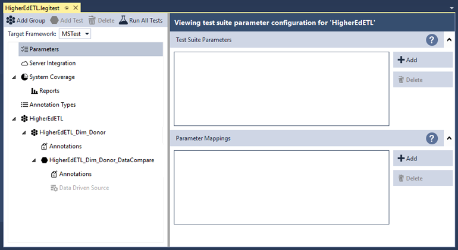
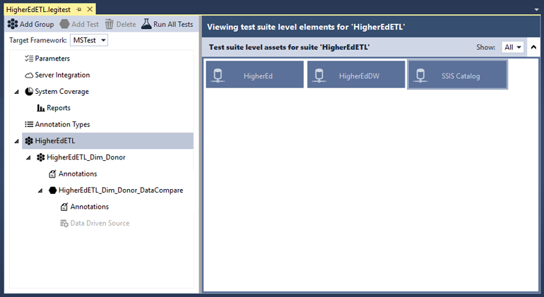
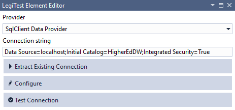
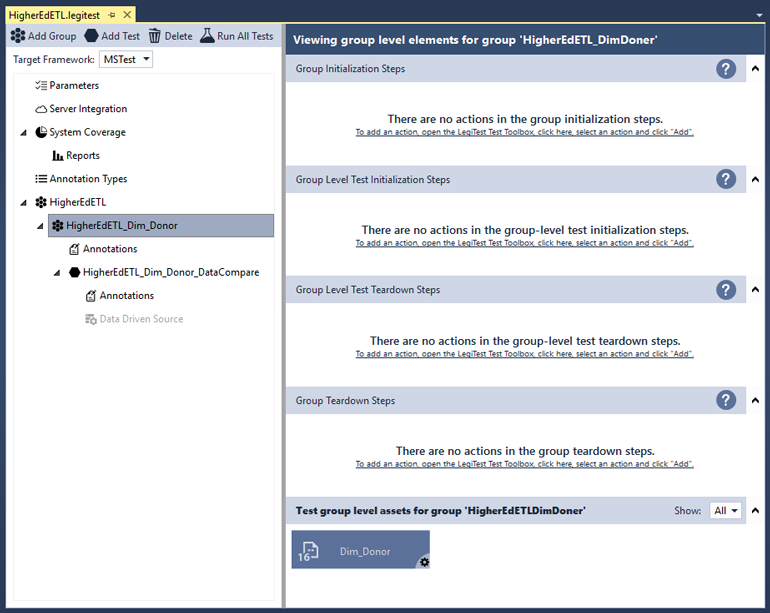
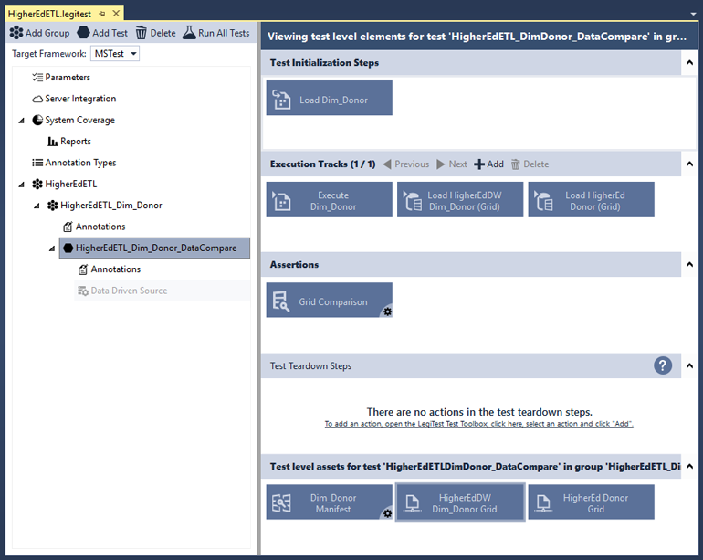



# Parameters Overview

Within the test suite / group, select the "Parameters" node to view parameter settings. This area allows user to create and manage parameters. We'll be revisiting this area shortly, for now let's look at the remaining pieces of the test.

If you select the "HigherEdETL" node, the view will change test suite level elements. Test suite level assets are available for use across all groups and tests. This test suite contains three assets:

- HigherEd: A [Connection](Connection.md) asset referencing the HigherEd database

- HigherEdDW: A [Connection](Connection.md) asset referencing the HigherEdDW database

- SIS Catalog: A [Connection](Connection.md) asset referencing the SSIS Catalog that stores the package

As of now, the HigherEdDW connection references our local data source. This will later be overridden with a parameter for easier deployment.

If you select the "HigherEdETL_Dim_Doner" node, the view will display group elements. Click here more information on a test group's test flow. Group level elements are only available for the specific group and its tests. This group contains a single asset:

- Dim_Donor: An [SSIS Package Reference](PackageReference.md) that references the SSIS package

Selecting the "HigherEdETL_Dim_Donor_DataCompare" node displays test elements.

>  Important Note:
> 
> Usually, test suites contain more than one test. This test suite has minimal complexity to better illustrate the use of parameters.

The "HigherEdETL_Dim_Donor_DataCompare" contains five main areas, though this test uses only four.

- Test Assets: Assets used by all elements within this test.

    * DimDonor Manifest: A Comparison Manifest that describes how to compare the Donor and Dim_Donor table

    * HigherEdDW Dim_Donor Grid: The Query Asset containing a T-SQL query that extracts the Dim_Donor table

    * HigherEd Donor Grid: The Query Asset containing a T-SQL query that extracts the Donor table

- Test Initialization Steps: These elements run before all execution tracks.

    * Load Dim_Donor: A Load Package action that loads the Dim_Donor package. LegiTest needs to load an SSIS Package before it can run within the execution track

- Execution Tracks: Each execution track runs asynchronously. Within a single execution track the actions run from left to right. This particular test contains only a single execution track.

    * Execute Dim_Donor:  An Execute Package action that executes the Dim_Donor package

    * Load HigherEdDW Dim_Donor (Grid): The Execute Query (Grid) loads the Dim_Donor table for comparison

    * Load HigherEd Donor (Grid): The Execute Query (Grid) loads the Donor table for comparison

- Test Teardown Steps: Elements within this area execute after all execution tracks. This sample test contains no elements within this area.

- Asserts: These elements determine whether the test passes or fails.

    * Grid Comparison: A Grid Comparison assert that compares whether Dim_Donor and  Donor are identical