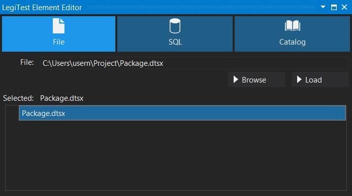
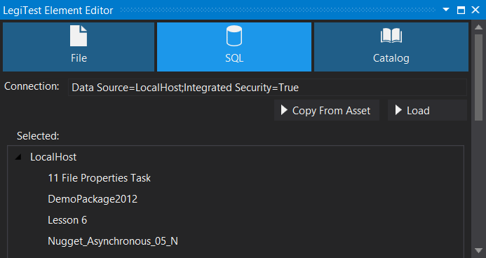
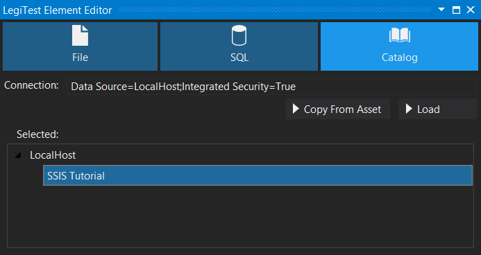



# Package Reference

The package reference assets are used to hold the location of an SSIS package. LegiTest has support for 2008, 2012, 2014, 2016 and 2017 packages. The user can browse for a package stored in a file system, or provide the connection string for packages stored on server or catalog. The catalog option is only available for 2012, 2014, 2016 and 2017 package references. Once the file location is added or connection string supplied, the user will click the load button to obtain a list of available packages. Once selected, the package can later be loaded using the Load Package action.

### For 2008, 2012, 2014, 2016 and 2017

#### File

**File -** Location of the package on the file system. The user can either type in directly, or use the browse button to search the machine for location of the package.

**Selected -** This area will be populated with available packages once a location is specified and the load button is clicked.

#### SQL

**Connection -** The connection string to the location of stored packages. This can either be typed or pulled from an existing Connection asset.

**Selected -** Once a connection string as provided and the user clicks load, this area will be populated with packages found on the server.

### For 2012, 2014, 2016 and 2017

#### Catalog

**Connection -** The connection string to the catalog's location. This can either be typed or pulled from an existing Connection asset.

**Selected -** Once a connection string is provided and the user clicks load, this area will be populated with packages found in the catalog.