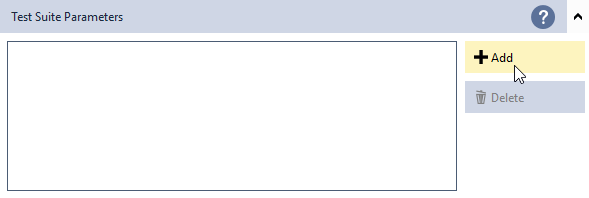
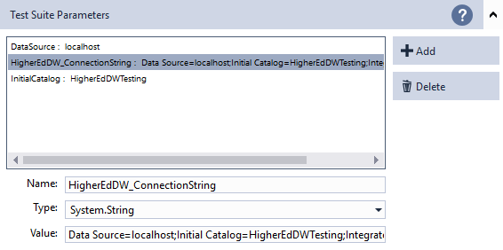
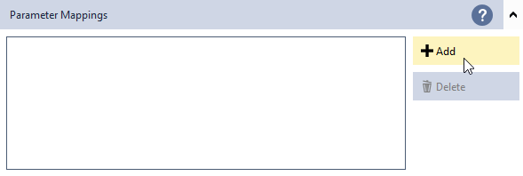
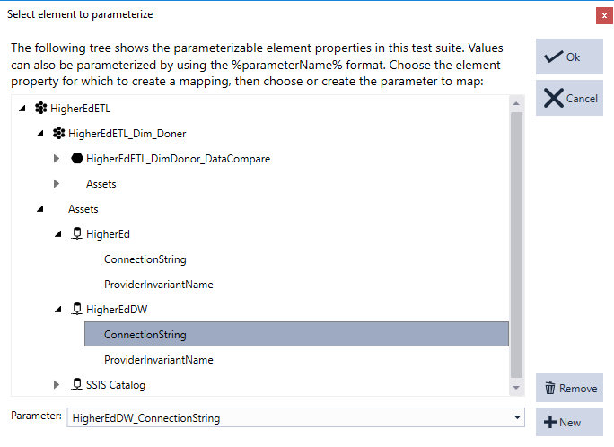
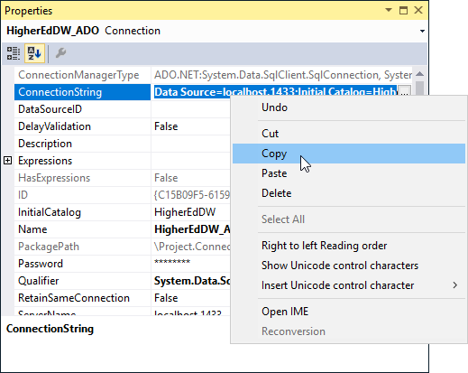
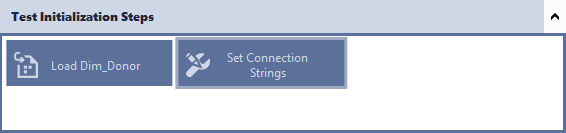
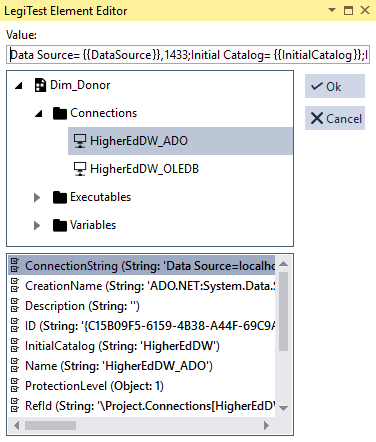
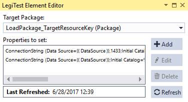



# Parameter Tutorial


As created, the test contains hard-coded package and connection references. Rather than using hard-coded references, parameters allow for flexible deployment across environments. This tutorial walks through the process of configuring the connections to reference parameters.


>  Important Note:
> 
> Parameters can be defined both in LegiTest suites as well as individual parameter files within the project. To add a parameter file to the project you can right click on the project node in solution explorer and click Add -> LegiTest Parameters File...


1.   From the parameter area, click the "Add" button




2.   Create the following parameters:


| Parameter Name              | Type          | Value                                    |
|-----------------------------|---------------|------------------------------------------|
| DataSource                  | System.String | localhost                                |
| HigherEdDW_ConnectionString | System.String | Data Source=localhost;Initial Catalog=HigherEdDWTesting;Integrated Security=True |
| InitialCatalog              | System.String | HigherEdDWTesting                        |




### Direct Property Replacement


Users can map parameters to properties within the LegiTest's Parameter area. This is the most basic form of parameter mapping. Direct property replacement completely replaces the entire property value with the value specified.


1.   From the test suite's parameter area, click the Parameter Mappings' "Add" button




2.   The next window displays an organized list of all available element properties. Navigate to the HigherEdDW connection asset and select its ConnectionString property.


3.   Within the parameter drop down list, select the HigherEdDW_ConnectionString parameter




4. Click "Ok"


### Parameter Token Replacement


Using parameter token replacement, users can replace portions of a property. This allows users to replace pieces of a property instead of the entire property. When using this method, LegiTest interprets these as a parameter.


```sql
{{ParameterName}}
```


All actions that rely on the HigherEdDW asset now use the HigherEdDW_ConnectionString parameter. The Dim_Donor package still contains connection managers pointing to the original database. The package's connection managers need parameter mappings as well.


1.   Within SSDT or BIDS, select each of the connection managers and view its properties.


2.   Copy out the connection's connection string property. This connection string property will form the baseline for the parameter token replacement. Do this for both connection strings.




Below are the original values for the connection strings.


| Connection String | Value                                    |
|-------------------|------------------------------------------|
| HigherEdDW_ADO    | Data Source=localhost,1433;Initial Catalog=HigherEdDW;Integrated Security=True;Application Name=SSIS-InvalidPackage-{C15B09F5-6159-4B38-A44F-69C9A98C8612}localhost,1433.HigherEdDW; |
| HigherEdDW_OLEDB  |  <br>Data Source=localhost,1433;Initial Catalog=HigherEd;Provider=SQLNCLI11.1;Integrated Security=SSPI;Auto Translate=False; |


3.   Back within LegiTest, select the HigherEdETL_Dim_Donor_DataCompare node.


4.   Add a Set Property action within the Group Initialization steps.




5.   Replace the Data Source and Initial Catalog within the connection strings. Below, with emphasis, are the replaced values for the connection strings. 


| Connection String | Value                                    |
|-------------------|------------------------------------------|
| HigherEdDW_ADO    | Data Source={{DataSource}},1433;Initial Catalog={{InitialCatalog}};Integrated Security=True;Application Name=SSIS-InvalidPackage-{C15B09F5-6159-4B38-A44F-69C9A98C8612}localhost,1433.HigherEdDW; |
| HigherEdDW_OLEDB  | Data Source={{DataSource}};Initial Catalog={{InitialCatalog}};Provider=SQLNCLI11.1;Integrated Security=SSPI;Auto Translate=False; |


6.   Select both Connections and replace the ConnectionString with their modified value




7.  There should be two ConnectionString property values that were changed. Once for HigherEdDW_ADO and again for HigherEdDW_OLEDB.




### Environment Token Replacement


Using environment token replacement, users can use system environment variables to replace portions of a property. This allows users to replace pieces of a property instead of the entire property. When using this method, LegiTest interprets these as a parameter.


```sql
%EnvironmentVariableName%
```


The steps to using environment token replacement are identical to parameter token replacement.