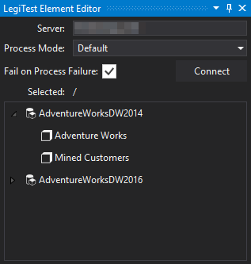



# Process Cube

The Process cube action helps bring a cube to a fully processed state. This action helps prepare a test by ensuring it is only testing against an updated cube.

>  Important Note:
> 
> The Process Cube action supports the following model types using the listed compatibilty levels:
> 
> - Multidimensional Model with compatibility level 1050 and higher
> 
> - Tabular Model with compatibility level 1100 and 1103
> 
> 
> 
> Use the [Process Table](ProcessTable.md) action to process Tabular tables set to compatibility levels 1200 or higher.
> 

Once the editor has loaded, the user will need to input the following properties:

1.   **Server:** The server location for the cube the user is planning to process. Click "Connect" to load all cubes stored on the server.

2.   **Process Mode:** Users can choose which processing mode to use depending on their preferences:

        * **Default:** Does the smallest amount of work required to bring the selected cube to a fully processed state

        * **Full:** Discards the data from the selected cube and completely rebuilds it

        * **Data:** Discards the data from the selected cube and rebuilds the data without building indexes

        * **Clear:** Discards the data from the selected cube

        * **Index:** Rebuilds the indexes for the selected cube. This requires the cube to already have its data built

        * **Defrag:** Optimizes the selected cube

3.   **Fail on Process Fail:** Determins if the test should also fail if the process cube action fails

4.   **Selected:** Displays the currently selected cube.

5.   **Server Tree:** After connecting, the server tree displays all available cubes.