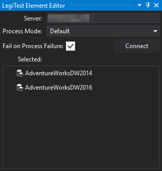



# Process Database

The Process Database action helps bring a cube to a fully processed state. This action helps prepare a test by ensuring it is only testing against an updated database.

Once the editor has loaded, the user will need to input the following properties:

1.   **Server:** The server location for the database the user is planning to process. Click "Connect" to load all databases stored on the server.

2.   **Process Mode:** Users can choose which processing mode to use depending on their preferences:

        * **Default:** Does the smallest amount of work required to bring the selected database to a fully processed state

        * **Full:** Discards the data from the selected database and completely rebuilds it

        * **Clear**: Discards the data from the selected database

3.   **Fail on Process Fail:** Determins if the test should also fail if the process database action fails

4.   **Selected:** Displays the currently selected database.

5.   **Server Tree:** After connecting, the server tree displays all available databases.