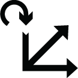
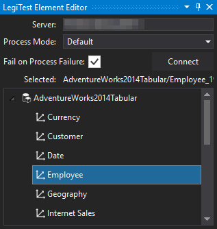



# Process Dimension

The Process Dimension action helps bring a cube to a fully processed state. This action helps prepare a test by ensuring it is only testing against an updated dimension.

Once the editor has loaded, the user will need to input the following properties:

1.   **Server:** The server location for the dimension the user is planning to process. Click "Connect" to load all dimensions stored on the server.

2.   **Process Mode:** Users can choose which processing mode to use depending on their preferences:

        * **Default:** Does the smallest amount of work required to bring the selected dimension to a fully processed state

        * **Full:** Discards the data from the selected dimension and completely rebuilds it

        * **Data:** Discards the data from the selected dimension and rebuilds the data without building indexes

        * **Clear:** Discards the data from the selected dimension

        * **Index:** Rebuilds the indexes for the selected dimension. This requires the dimension to already have its data built

        * **Update:** Incrementally brings the selected dimension to a fully processed state

3.   **Fail on Process Fail:** Determins if the test should also fail if the process dimension action fails

4.   **Selected:** Displays the currently selected dimension.

5.   **Server Tree:** After connecting, the server tree displays all available dimensions.