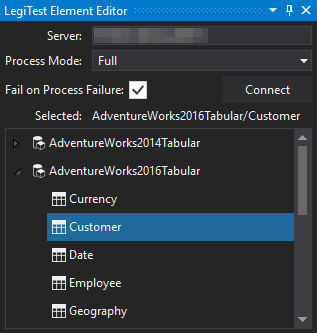



# Process Table

The Process Table action helps bring a cube to a fully processed state. This action helps prepare a test by ensuring it is only testing against an updated table.

>  Important Note:
> 
> The Process Table action supports the following model types using the listed compatibilty levels:
> 
> - Tabular Model with compatibility levels above 1200
> 
> 
> 
> Use the [Process Cube](ProcessCube.md) action to process Tabular tables set to compatibility levels below 1200.

Once the editor has loaded, the user will need to input the following properties:

1.   **Server:** The server location for the table the user is planning to process. Click "Connect" to load all tables stored on the server.

2.   **Process Mode:** Users can choose which processing mode to use depending on their preferences:

        * **Default:** Does the smallest amount of work required to bring the selected table to a fully processed state

        * **Full:** Discards the data from the selected table and completely rebuilds it

        * **Data:** Discards the data from the selected table and rebuilds the data without building indexes

        * **Clear:** Discards the data from the selected table

        * **Defrag:** Optimizes the selected table

3.   **Fail on Process Fail:** Determins if the test should also fail if the process table action fails

4.   **Selected:** Displays the currently selected table.

5.   **Server Tree:** After connecting, the server tree displays all available tables.