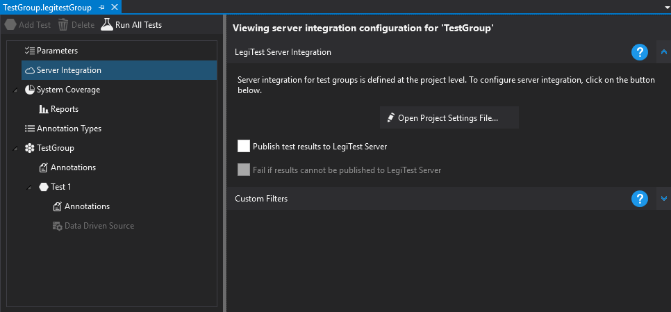



# Publishing Results

Publishing results can be controlled for each LegiTest Group. When clicking on the 'Server Integration' node, the following display is visible:

Here we can click on 'Publish test results to LegiTest Server' - which means that when the test runs, information will be sent to the [server configured in the project settings](ConnectingToAServer.md).

>  Important Note:
> 
> Server integration is controlled by parameters. Whether a test group publishes results or not is controlled by the 'PublishResultsToLegiTestServer' parameter, and the server to which results are published is controlled by the 'LegiTestServerUrl' parameter.
