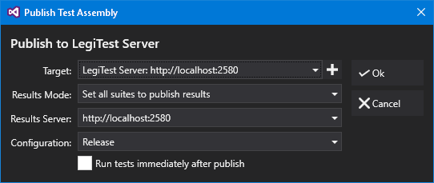



# Publishing Test Assemblies

When we are finished developing our tests, we can publish the resulting test assemblies to LegiTest Server so that they can be run on a schedule or manually through the web interface. To do this, right click on the project you want to publish and click 'Publish to LegiTest Server...'

The options available to us are:

- Target

    Here we can specify the server that we are publishing the assemblies to, or specify a file path to which to copy the built assemblies. A new server can be added by clicking on the '+' button.

- Results Mode

    We can specify frome the following options:

    - 'Set all suites to publish results' - All suites / groups in the project are set to send their results to a server when they run

    - 'Set all suites not to publish results' - All suites / groups in the project are set so that results are not sent at runtime

    - 'Do not change suite settings' - No settings are changed - so each suite / group will publish results according to the [setting set on the 'Server Integration' node](PublishingResults.md).

    - 'Remove suite settings to inherit global configuration' - The setting is removed from each suite - and the setting will be picked up from a [global parameter file](ettingsFilesAndGlobalParameters.md).

- Results Server

    This is the server to which results will be sent when the assemblies are run after being published.

- Configuration

    We can specify the 'Debug' or 'Release' configuration for the C# compiler to use. For most situations, 'Release' is the correct configuration to use for deployed tests.

- Run tests immediately after publish

    When this option is checked, tests will be run by the server as soon as publishing is complete.

