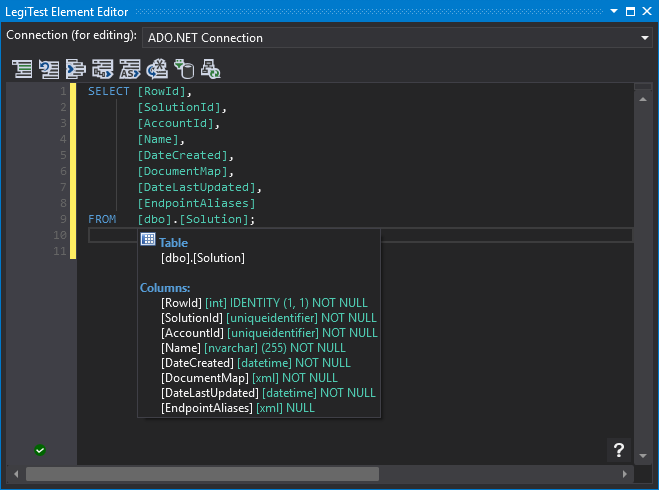



# Query

The query asset is used to store queries.

#### Query Editor

The query editor provides an advanced editing experience when connected to a SQL Server or Azure SQL instance. You can select the connection from the drop-down at the top of the editor, which will load information about the schema of the database against which the query will run. The selection is remembered for the duration of the session.

Briefly, the query editor provides the following features:

- Code completion (suggestion lists after . or when Ctrl+Space is pressed)

- Quick info (hover an object name for information about that object)

- Refactoring (tracked renaming of variables and temporary objects, query formatting, object qualification)

- Parameter information (shows the parameters expected for procedure and function calls)

- Column choosers (choose which table to resolve an ambiguous column to)

- Synonym resolution (work with synonyms with the full IntelliSense experience)

- Shortcuts (e.g. 'ssf' -> 'SELECT * FROM', st100 -> 'SELECT TOP 100 * FROM')

- Tab expansion (press tab when the caret is to the right of a * in order to specify all columns)

A summary of the available functions can be found by clicking the '?' icon in the bottom right hand corner of the editor.