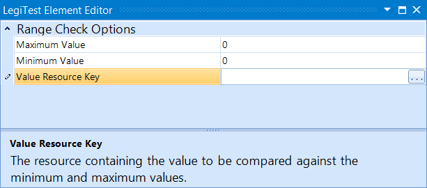



# Range Check

The Range Check assert will check a resource key's value, and check to see if is between the user set maximum and minimum value.

#### Range Check Editor

**Maximum Value -** The maximum allowable value for the Value Resource Key

**Minimum Value -** The minimum allowable value for the Value Resource Key.

**Value Resource Key -** The user will select a resource key in which to compare a value.