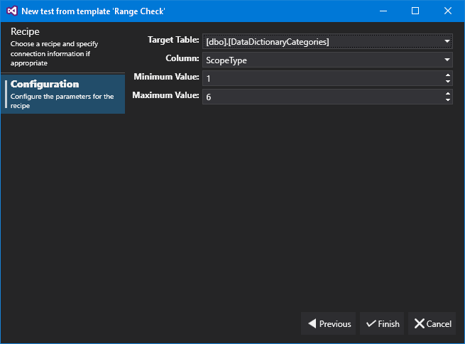



# Range Check

The Range Check recipe allows us to select a table and column to check that all values fall within a specific range. In the example above, we are checking that the table 'dbo.DataDictionaryCategories' does not have any values in the 'ScopeType' column that are not between 1 and 6.