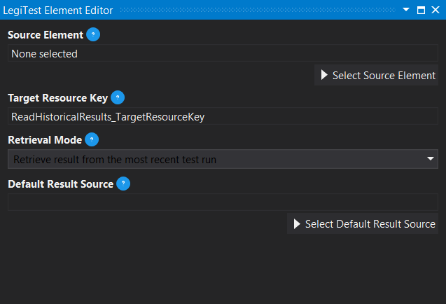



# Read Historical Results

The Read Historical Results actions allows a user to specify a past run of an assert, grab that results, and compare it to a more recent or previous result. This will allow a user to compare results over time to and keep track of test quality over time.

>  Important Note:
> 
> The Read Historical Results action only works with test suites / groups that publish their results to LegiTest Server or LegiTest Online. For more information about server integration, please see the topic [here](IntegratingWithLegiTestServerOrL.md).

#### Read Historical Results Editor

**Source Element -** Clicking the Select Source Element will bring up a selection diaogue to allow the user to select an assert from the suite / group.

**Target Resource Key -** The name assigned to the result that is stored in the Test Resources.

**Retrieval Mode -** There are three retrieval modes available to choose from:

       

- **Retrieve result from the most recent test run -** This option will get the result from the very last time this assert was run.

- **Retrieve result from a previous test run -** This option will bring up another option to be filled in: **Number of Run**s. This field determines which run to get, 1 would be the previous run, 2 would be two runs ago and so on.

- **Retrieve the result from a test run between two dates/times -** This option will bring up two new fields, **Start Date**  and **End Date**. Here a user will select a start and end time for searching for a result, then the first assert in that time frame will be used.

**Default Result Source -** The default result source is used when the action is not able to retrieve an existing assert in the options provided