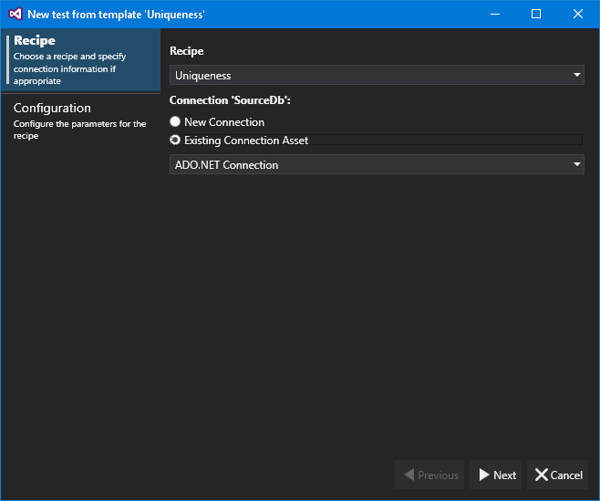
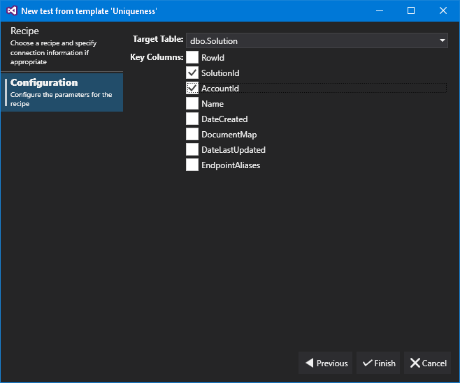



# Recipes

Recipes are a simple way to create tests based around smaller pieces of functionality - allowing users to get started with testing even quicker than before.

The recipe first page allows you to choose the recipe that you want to use to create a test. If the recipe requires any connections then you can specify those connections on this page too, either using an existing asset or configuring a new connection.

The recipe second page is specific to the recipe. This is an example of the 'Uniqueness' recipe, in which we select a table to check and the columns which form the unique key. For information about the individual recipes, please check the topic for the recipe.

Recipes

- [Range Check](RangeCheck1.md)

- [Row Count Comparison](RowCountComparison.md)

- [Standard Deviation](StandardDeviation.md)

- [Uniqueness](Uniqueness.md)