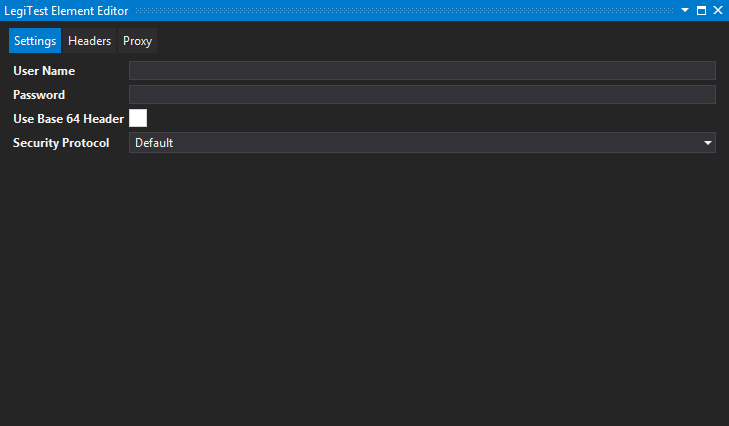
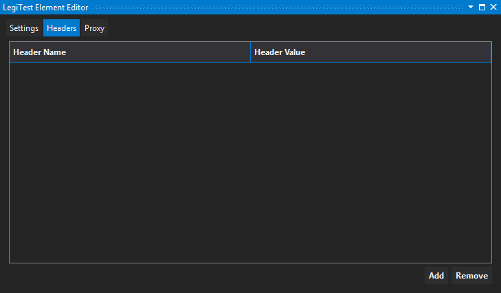
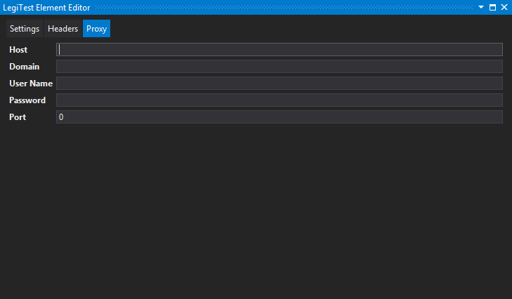



# Rest Connection (Basic)


The Rest Connection (Basic) connects to a web API. It is used in the Execute Rest Query (Grid) and Execute Rest Query (Scalar) actions.


#### Settings




**User Name -** The username needed to authenticate to the endpoint Url.


**Password -** The password that allows the user to authenticate to the endpoint Url.


**Use Base 64 Header** - Check this option when your endpoint requires you to use a basic authentication header using Base 64 Encoding.

(For example, this is how the header is added to the request:

```csharp
webRequest.Headers.Add("Authorization", string.Format("Basic {0}", Convert.ToBase64String(Encoding.ASCII.GetBytes(string.Format("{0}:{1}", UserName, Password)))));
```


             

**Security Protocol -** Identifies the transport layer security or secure sockets layer used by the endpoint. Options include: Default, SSL3, TLS1.0, TLS1.1, TLS1.2


#### Headers


#### Can be used to add headers to every request being used by the connection.




#### Proxy




**Host -** When connecting to an endpoint using a proxy, users should enter the address of the proxy server..


**Domain -** (Optional) The domain of the user logging in.


**User Name -** The username to authenticate to the proxy.


**Password -** The password to authenticate to the proxy.


**Port -** The port number needed to connect to the proxy.