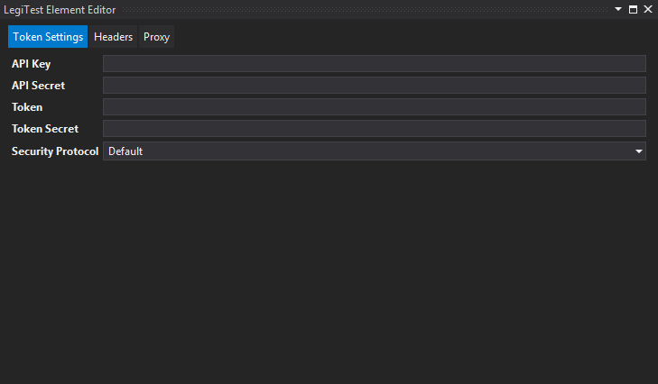
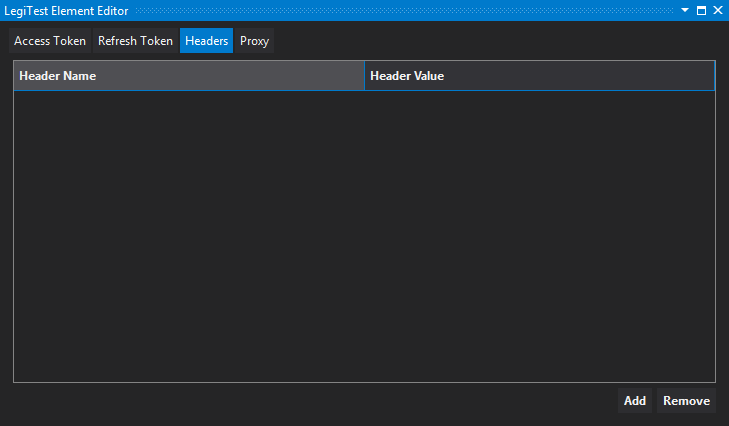
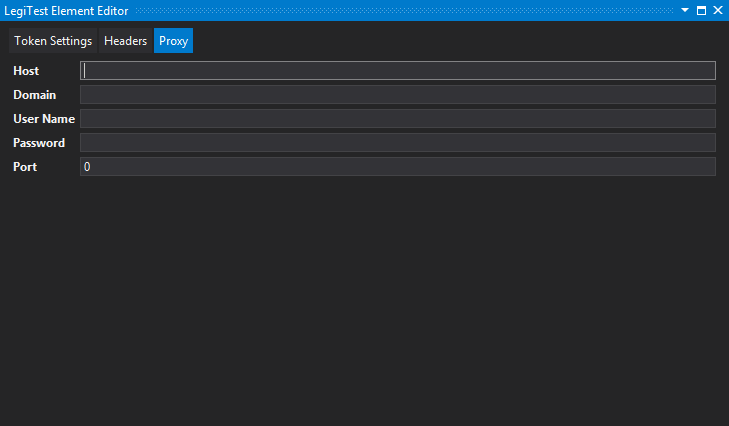



# Rest Connection (OAuth1)

The Rest Connection (OAuth1) connects to a web API that uses OAuth1 security. It is used in the Execute Rest Query (Grid) and Execute Rest Query (Scalar) actions.

#### Token Settings

**API Key -** Authentication key provided at the application's developer site.

**API Secret -** Authentication secret provided at the application's developer site.

**Token -** The token required by the web API. This information is provided at the application's developer site.

**Token Secret -** The token's secret "password" provided at the application's developer site.

**Security Protocol -** Identifies the transport layer security or secure sockets layer used by the endpoint. Options include: Default, SSL3, TLS1.0, TLS1.1, TLS1.2

#### Headers

Can be used to add headers to every request being used by the connection.

#### Proxy

**Host -** When connecting to an endpoint using a proxy, users should enter the address of the proxy server..

**Domain -** (Optional) The domain of the user logging in.

**User Name -** The username to authenticate to the proxy.

**Password -** The password to authenticate to the proxy.

**Port -** The port number needed to connect to the proxy.