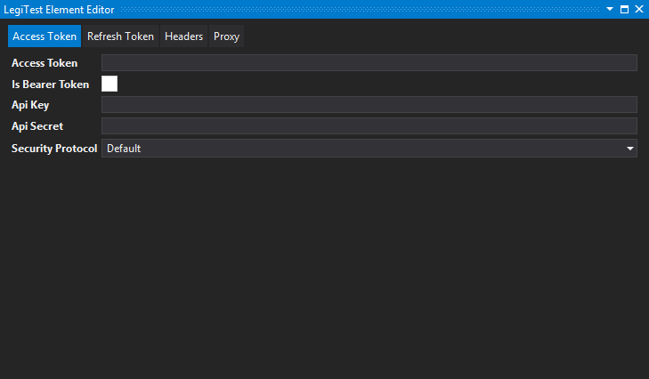
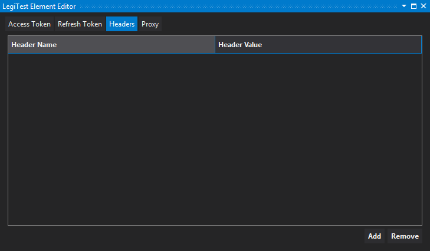

# Rest Connection (OAuth2)


The Rest Connection (OAuth2) connects to a web API that uses OAuth2 security. It is used in the Execute Rest Query (Grid) and Execute Rest Query (Scalar) actions.


#### Access Token




**Access Token -** Carries the necessary information the API uses to determine whether the client is authorized or not. The access token provided at the application's developer site.


**Is Bearer Token -** An authorization header that is required by some API's. If the API issues a bearer token, click this option.


**API Key -** Authentication key provided at the application's developer site.


**API Secret -** Authentication secret provided at the application's developer site.


**Security Protocol -** Identifies the transport layer security or secure sockets layer used by the endpoint. Options include: Default, SSL3, TLS1.0, TLS1.1, TLS1.2


#### Refresh Token


**Refresh Token -** The token given to the user by the application/service. This call allows users to request new access tokens.


**Refresh Token Endpoint -** The refresh token URL. 
Example: https://accounts.google.com/o/oauth2/auth


**Refresh Token Endpoint Parameters -** The query parameters used during the refresh token request

Example:
```html
scope=https://www.googleapis.com/auth/drive.file&

 state=security_token%3D138r5719ru3e1%26url%3Dhttps://oa2cb.example.com/myHome&

 redirect_uri=https%3A%2F%2Fmyapp.example.com%2Fcallback&

 response_type=code&

 client_id=8127352506391.apps.googleusercontent.com&

 approval_prompt=force&

 include_granted_scopes=true
```


**Access Token Json Path -** When making the request to get a new access token, the service will return that access token in Json. This property is the path to that token. For example the path to the access token below is access_token.

{ "access_token": "ERLKJDSLKDJLK!1231223", "expires_in" : 3180 }


#### Headers

Can be used to add headers to every request being used by the connection.




#### Proxy


**Host -** When connecting to an endpoint using a proxy, users should enter the address of the proxy server..


**Domain -** (Optional) The domain of the user logging in.


**User Name -** The username to authenticate to the proxy.


**Password -** The password to authenticate to the proxy.


**Port -** The port number needed to connect to the proxy.