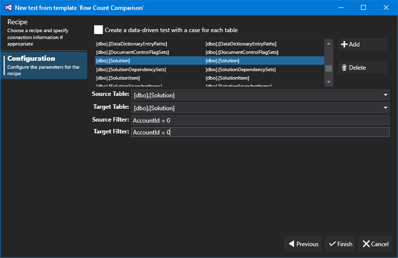



# Row Count Comparison

The Row Count comparison recipe allows us to generate a test that compares row counts between databases. For this recipe, we choose two connections and then configure tables to map. By default, all tables with the same name will be mapped automatically.

We can add new mappings by clicking the 'Add' button, and then selecting the source and target tables using the drop-down boxes. Optionally, we can configure filters for both sides - so the example above will only inlcude columns for the table 'dbo.Solution' where 'AccountId' is equal to zero. Not that the filter is any valid SQL syntax that can be placed in the WHERE clause.

Additionally, we can create a data-driven test - where the row count comparison for each individual table is created as it's own test case.