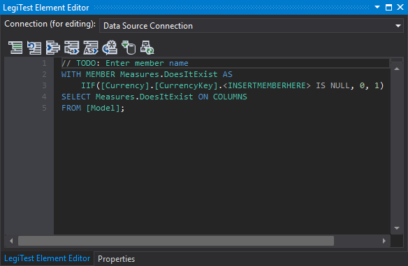

# SSAS Validation Testing

The SSAS Validation Testing wizard builds a suite of tests spanning an entire database. This shortens the time it takes to build tests. Building test coverage to help detect corrupt or inaccurate data within an SSAS database.

### Specify Database

When launched, the wizard presents an empty display. The database window specifies the server and database used within the validation testing wizard.

### Select Items to Test

Once loading completes, select all items the user wishes to validate. The items available depends on whether the database model type and compatibility level.

- Multidimensional databases will display the database's cubes.

- Tabular databases with compatibility levels between 1100 and 1103 will display the database's cubes.

- Tabular databases with compatibility levels of 1200 or higher will display the database's tables.

Once satisfied with the items to include within the validation testing, click "Next".

### Specify Options

On the specify options window, users select the types of tests to generate.

Once satisfied with the options, click "Finish". LegiTest will build several test groups and tests. The amount generated depends on the number of measures and attributes present.

Due to the nature of the tests generated, users may need to correct validition errors. These errors typically occur within the "Check if a specific attribute memeber exists" tests.

In order to remove the validation errors, users will need to specify the member. Replace "< INSERTMEMBERHERE >" with the desired member.