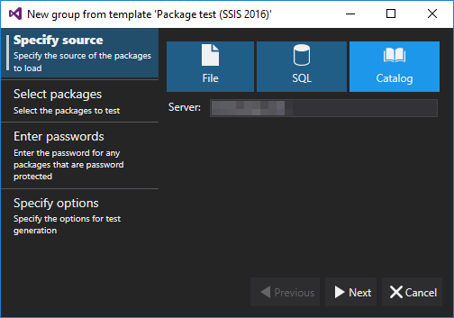
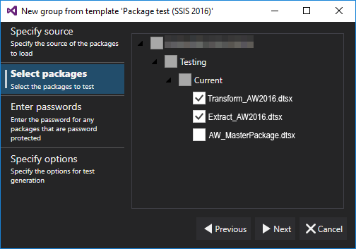
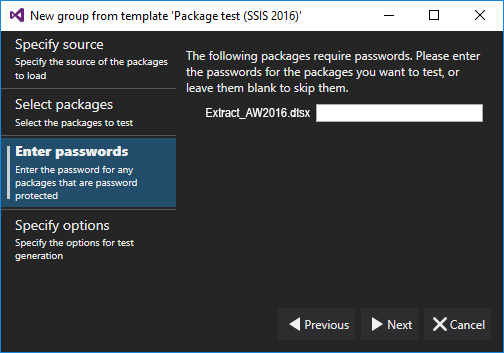
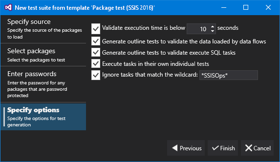



# SSIS Package Testing

The SSIS Package wizards builds a suite of tests for each package. These tests ensure smooth execution, extraction, and validation of data results.

The SSIS Package wizard requires SSIS installed to build and execute the tests. Within the development environment, LegiTest only displays versions of SSIS that are currently available. The tests generated by this wizard need SSIS installed on all systems planning to run the tests.

### Specify Source

When launched, the wizard presents an empty display. This window allows navigating to the location of the packages the user wishes to load.

Users can load packages from the following locations:

- File

- SQL

- Catalog

If the user wishes to deploy these tests to LegiTest Server, it must have access to these packages as well.

### Select Packages

The select packages window allows users the ability to select the desired packages they wish to load.

### Enter Password

If any of the packages are encrypted using a password, LegiTest requires the password to be specified.

### Specify Options

On the specify options window, users select the types of tests to generate.

Once satisfied with the options, click "Finish". LegiTest will build several test groups and tests. The amount generated depends on the number of packages and data flows present.

Due to the nature of the tests generated, users may need to correct validition errors. These corrections typically occur within the data flow tests.

>  Important Note:
> 
> The 'Ignore Tesks' filter is a wildcard filter - so * may be used to represent zero or more characters and ? may be used to represent a single character
