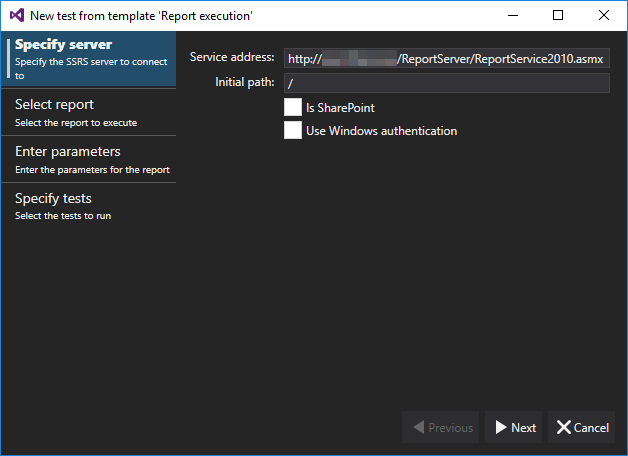
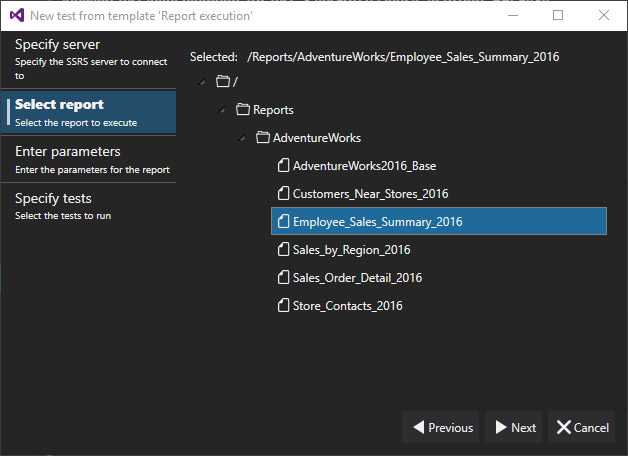
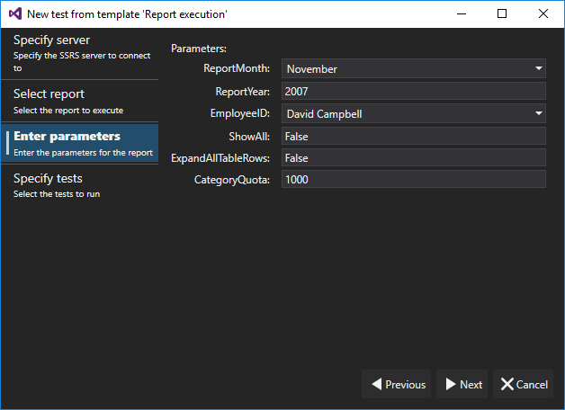
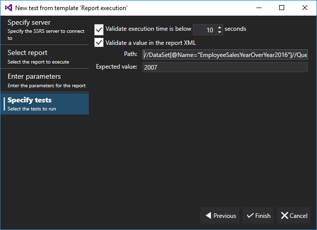



# SSRS Report Execution

The SSRS Report Execution wizard tests report executions based on specific report parameters. This wizard ensures the report execution results are accurate given the specified parameters.

### Specify Source

When launched, the wizard presents an empty display. This window allows users to specify the SSRS web service they wish to use.

The web service can be either a native or SharePoint Web Service. When using a SharePoint Web Service, be sure to select the "Is SharePoint" checkbox. Depending one the type of web service, the format for the web service and initial path will be different.

### Native Web Service

- Service Address: http[s]://<ServerName>[:<Port>]/ReportServer[_<InstanceName>]/ReportService2010.asmx

- Initial Path: To specify the root folder of a native web service, use "/". Otherwise, users can build the path to the starting folder.

    - **Example initial paths:**

        - /

        - /SharedDocuments/ReportFolder

### SharePoint Web Service

- Service Address: http[s]://<ServerName>[:<Port>]/_vti_bin/ReportServer[_<InstanceName>]/ReportService2010.asmx

- Initial Path: To specify the root folder of a SharePoint web service, use "http[s]://<ServerName>[:<Port>]/". Otherwise, users can build the path to the starting folder.

    - Example initial paths:

        - http[s]://<ServerName>[:<Port>]

        - http[s]://<ServerName>[:<Port>]/SharedDocuments/ReportFolder

### Select Report

On the select reports window, navigate through the web service folders to the target report.

After selecting the report and clicking "next", LegiTest will quickly load the report's parameters.

### Enter Parameters

On the enter parameters window, users can update the parameters to the report.

### Specify Tests

On the specify options window, users select the types of tests to generate.

Once satisfied with the parameters and options, click "Finish". LegiTest will build a test group for the report.