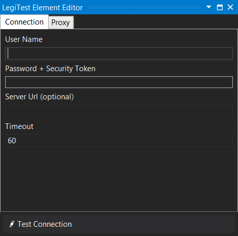
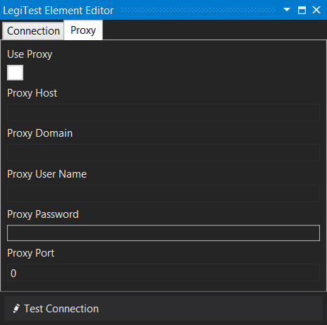



# Salesforce Connection

The Salesforce Connection asset provides the user with an easy way to create a connection to their Salesforce source. The editor also allows the user to set up a connection through a proxy.

#### Salesforce Connection Editor

 

**User Name -**  The Salesforce user name.

**Password + Security Token -** This field requires both the password and the security token provided by salesforce to be enetered together.

**Server Url -** An optional field to specify the server that hosts the connection.

**Timeout -** The amount of time to wait before the connection times out.

**Use Proxy -** Check to enable the use of the proxy settings below.

**Proxy Host -** The address of the proxy to be used.

**Proxy Domain -** Domain address of the proxy.

**Proxy User Name -** User name used to log into the proxy.

**Proxy Password -**  Password to log into the proxy.

**Proxy Port -** Port specified to be used by the proxy connection.

**Test Connection -** Clicking test connection, will test the current settings and ensure they can connect.