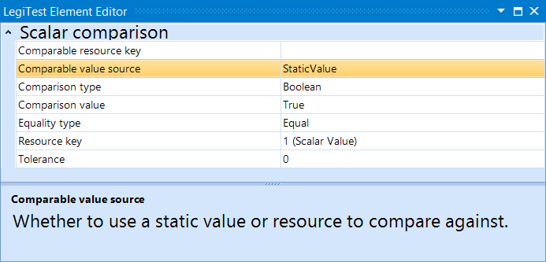



# Scalar Comparison

>  Important Note:
> 
> The Scalar Comparison assertion is now deprecated. While existing projects can still continue to use it, new products should migrate to using the [Value Comparison](ValueComparison.md) assertion.

The scalar comparison takes the result of an execute scalar action and compares with either a static value or another scalar result. The scalar values can be of several different types, each with their own specifications of equality.

#### Scalar Comparison Editor

**Comparable Resource Key -** If the user does not opt to use a static value to compare against, this is where the resource key for the dynamic value will be entered.

**Comparable Value Source -** Specify whether to use a static value or a dynamic value from another resource key.

**Comparison Type -** Specify the type of the value to be compared:

- Boolean

- DateTime

- Decimal

- Floating Point

- Guid

- Integer

- Text

**Equality Type -** Specify the equality type of Equal, Not Equal, Within Percent Tolerance, or Within Fixed Tolerance.

**Resource Key** - The value to be compared.

**Tolerance -** Used to specify fixed or percent tolerance for certain value types.