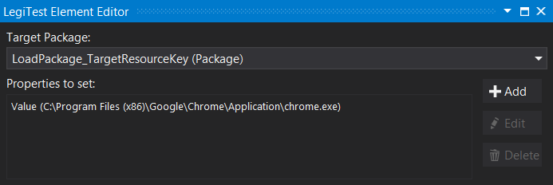
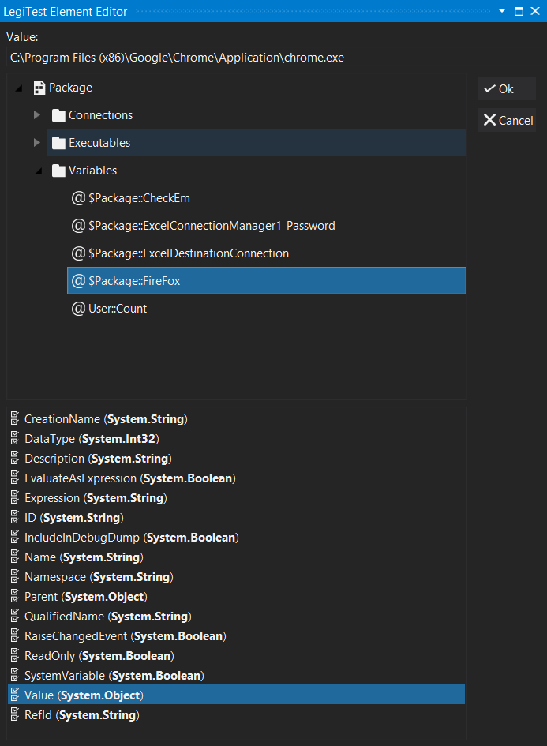



# Set Properties

The set properties actions allows a user to set the properties of a package during the test run. A user can set multiple properties using just the one element.

**Target Package -** The reference key of the package to be used.

**Properties to set -** The list of properties added to the element to be set.

**Add -** Takes the user to the add property window where they will select the property to be changed.

**Edit -** Takes the use user to the add property window with the focus on the selected property.

**Delete -** Deletes the selected property from the set editor.

In this image the variable @User::Count is having its value set to 23456.

