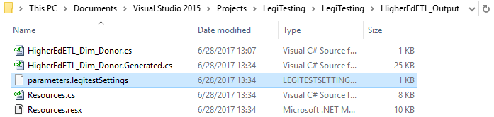



# Settings Files and Global Parameters


### Settings files


The previous tutorial explained how to use parameters within Visual Studio.  Within the MSTest and nUnit command line LegiTest can use setting files. These setting files control parameters during runtime. LegiTest even generates the file for you when building the project. This parameters file is located within the output folder.




1.   When a test runs, LegiTest looks in the following locations for setting files (in this order):


- The directory where the test assembly is located

- %PROGRAMDATA%\PragmaticWorks\LegiTest (e.g. C:\ProgramData\PragmaticWorks\LegiTest)

- %USERPROFILE%\Documents\PragmaticWorks\LegiTest (e.g. C:\Users\jsmith\Documents\PragmaticWorks\LegiTest)


After this search is done, the same set of directories is searched again, for legitestSettings files that have the correct 'applicableTestSuiteId' attribute.


>  Helpful tip:
> 
> In order to find the correct 'applicableTestSuiteId' for a test group / suite, open up the file in notepad and look for the 'uniqueId' attribute on the TestSuite node in the xml.


Any settings that are found in a location **later** in the list will over-ride any that are found previously.


So - for example, a setting called 'TargetServer' in the directory where the assembly is located will be over-ridden by a setting called 'TargetServer' in the user profile directory. However, a setting called 'TargetServer' in a file that has the applicableTestSuiteId attribute correctly set and exists in the assembly directory would over-ride the same setting from a file in the user profile where the applicableTestSuiteId was not present.


To clarify, the following is a list of locations, in increasing order of importance:


- Assembly directory without applicableTestSuiteId attribute

- %PROGRAMDATA% without applicableTestSuiteId attribute

- %USERPROFILE% without applicableTestSuiteId attribute

- Assembly directory with applicableTestSuiteId attribute

- %PROGRAMDATA% with applicableTestSuiteId attribute

- %USERPROFILE% with applicableTestSuiteId attribute


>  Important Note:
> 
> Pragmatic Works recommends using the Program Data location to store legitestSettings files. These directories can hold many *.legitestSettings files, the file names are not important. LegiTest only searches for files with the *.legitestSettings extension. We recommend renaming setting files after the tests they belong to.


2.   Below is sample content of a settings file:


```xml
<?xml version="1.0" encoding="utf-8" ?>

<ParameterSet applicableTestSuiteId="a3856bd9-e9fe-460e-bf83-5104eff9458a">

<Parameters>

<Parameter name="HigherEdDW_ConnectionString" type="System.String" value="Data Source=localhost;Initial Catalog=HigherEdDWTesting;Integrated Security=True" />

<Parameter name="DataSource" type="System.String" value="localhost" />

<Parameter name="InitialCatalog" type="System.String" value="HigherEdDWTesting" />

</Parameters>

<Mappings>

<Mapping parameterName="HigherEdDW_ConnectionString" targetElementId="bea91e70-8d45-480f-8c63-f568388cf8dd" targetPropertyName="ConnectionString" />

</Mappings>

</ParameterSet>
```


1.   **applicableTestSuiteId:** Associates the collection of parameters and mappings with the test suite that has that specific identifier. Only test suites with the corresponding id will use this setting file.


>  Important Note:
> 
> Global Parameters are parameters within a settings file that don't include an applicableTestSuiteId. In such a scenario, all test suites executed on that machine would use those global parameters. More details regarding the usage of global LegiTest Setting files and parameters can be found below.


2.   targetElementId: Associates a parameter value to a specific element within the test suite using the element's unique identifier. The targetPropertyName attribute reference's the specific property that the parameter value will replace.


### Global parameters


In the previous tutorial, we parameterized only the connection strings of a test suite. LegiTest can use parameters throughout all its [actions](Actions.md), [asserts](Asserts.md), and [assets](Assets.md). The [Query](Query.md) asset is another good example where parameters would be useful.


Through the use of parameters, users can transition between many environments. Parameters help keep the testing process flowing through the various stages of development.


Global Parameters are parameters applied to all test suite executions on a machine. When modifying a settings file, removing the applicableTestSuiteId creates a global settings file. The most common use would be between [publishing LegiTest assemblies](PublishingAssemblies.md) to LegiTest Server.


```xml
<?xml version="1.0" encoding="utf-8" ?>

<ParameterSet>

<Parameters>

<Parameter name="HigherEdDW_ConnectionString" type="System.String" value="Data Source=localhost;Initial Catalog=HigherEdDWTesting;Integrated Security=True" />

<Parameter name="DataSource" type="System.String" value="localhost" />

<Parameter name="InitialCatalog" type="System.String" value="HigherEdDWTesting" />

</Parameters>

</ParameterSet>
```


Global parameters allow the establishment of commonly named parameters across all environments. After publishing to a new environment, future executions use that environment's settings file. The most common use would be redirecting connection strings between database deployments.


>  Important Note:
> 
> Pragmatic Works recommends using the Program Data location for global legitestSettings files. Though users can have more, we recommend only one global file per machine.
