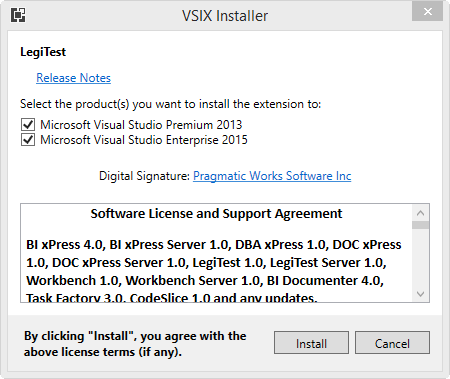

# Setup Instructions

Before begining installation, please review [Hardware](HardwareRequirements.md) and [Software Requirements](SoftwareRequirements.md) to verify that your environment meets the system requirements.

Users can install LegiTest in one of two ways:  
- Through the [Pragmatic Workbench installer](#installing-from-pragmatic-workbench)
- Through the [Visual Studio Marketplace](#installing-from-the-visual-studio-marketplace)

## Installing from Pragmatic Workbench 

1. Install Pragmatic Workbench [following these directions](http://help.pragmaticworks.com/docxpress/index.html). If you select a custom install, ensure that the LegiTest option is selected.
1. After the Workbench installation completes, you will be prompted to install the LegiTest Visual Studio extension. Select the versions of Visual Studio that you want use with the extension.   

A

1. If you chose "Typical" install in [step 4](SetupInstructions.html#Step4), opted to install LegiTest, or are installing LegiTest through the Visual Studio Gallery, the Visual Studio Extension installer will appear. This allows users to choose which versions of Visual Studio will contain LegiTest.

## Installing from the Visual Studio Marketplace

Once the installation has completed, the selected Visual Studio editions will be ready to [create a new LegiTest project](Overview.html#CreatingANewProject).
