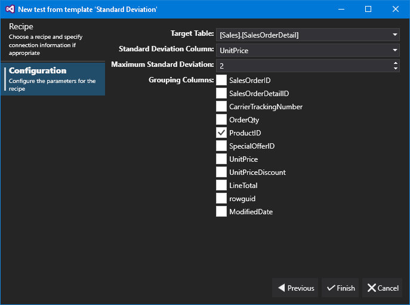



# Standard Deviation

The Standard Deviation recipe allows us to check that the standard deviation for a column is below a given maximum, optionally specifying columns to group by. So, in the example above, we are checking that the table 'Sales.SalesOrderDetail' does not have a standard deviation over 2 for the column 'UnitPrice' when grouped by the column 'ProductId'.