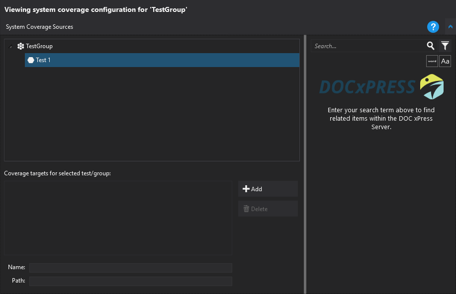
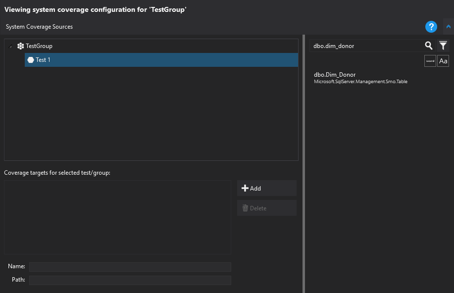
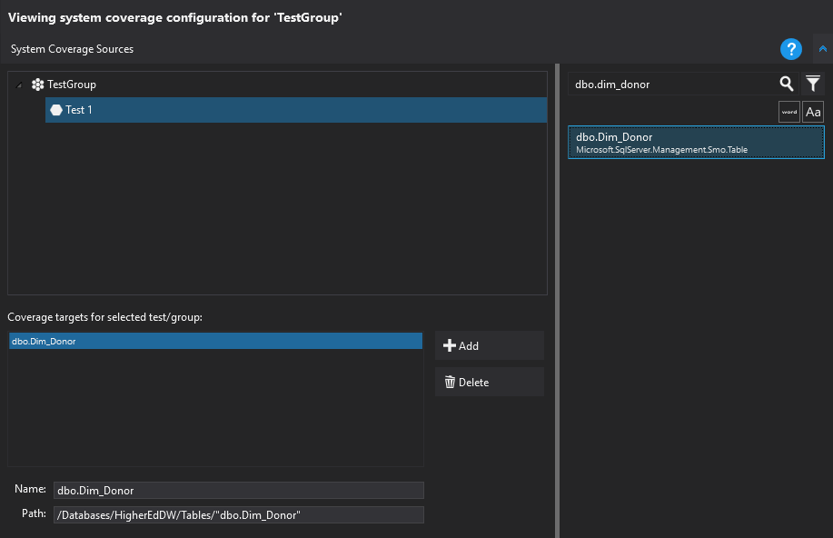



# System Coverage

System Coverage allows a view of which objects have been tested within a system. There are two modes of operation - DOC xPress integrated and standalone.

### DOC xPress Integrated

In this mode, information about which objects are available for test comes from DOC xPress Server. Because there is a solution snapshot present, the system can tell what items there are to test. LegiTest Client shows the DOC xPress Metadata Search tool, and you can pick items from your DOC xPress Server to mark as tested. This means that there are four available categories of output:

- Passed - An item is covered by a passing test

- Failed - An item is covered by a failing test

- Inconclusive - An item is covered by a failing test

- Not covered - An item is known in the DOC xPress Server database, but no tests that cover it have been run

### Standalone

In standalone mode, there isn't any information about what objects there are to test. Because of that, System Coverage is only able to show the first three categories of output above. Individual items are assigned identifiers by the user, and those identifiers are how the system collates data.

### Setting up Coverage Information

When setting up system coverage there are two parts that must be configured - the binding of items to tests and the configuration of viewable reports on the server. Information on setting up system coverage on LegiTest Server can be found here.

In the client, selecting the 'System Coverage' node in a test group shows the following display:

On the right is the DOC xPress Metadata Search, allowing us to find items to mark as covered. On the left is a tree which represents the content of the current group / suite. Entering a search term returns us the results from the server:

By clicking on an item in the left hand tree and then double clicking the found item in the right hand pane, the item is the bound to the test. Now when the test runs, that item will be considered 'covered' and will have a status of 'Passed', 'Failed' or 'Inconclusive' depending on the test outcome.

