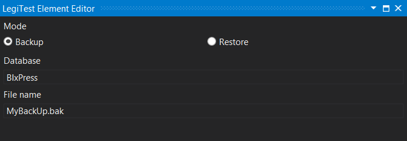



# T-SQL Backup / Restore

This asset can be used to either store a backup or restore SQL command, that can later be used with Execute Query Command action. Backups and restores will use the default backup location of the system running the test.

#### Backup / Restore Editor

**Mode -** Select either Backup or Restore.

**Database -** The name of the database to be backed up or restored.

**File Name -** The name of the file to be restored, or the name to give the backup.