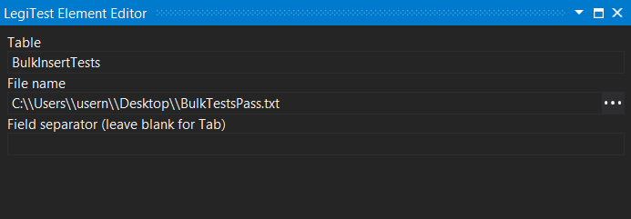



#### T-SQL Bulk Insert

This asset stores the information for a bulk insert that can be executed using the Execute Query Command action. The user will specify the table the data is to be inserted into, a file that contains the information, and the field separator.

Bulk Insert Editor

**Table -** The table for the data should be inserted into.

**File Name -** The location of the file that holds the data to be inserted.

**Field Separator -** If the data uses a separator other than the default tab, the user can specify it here.