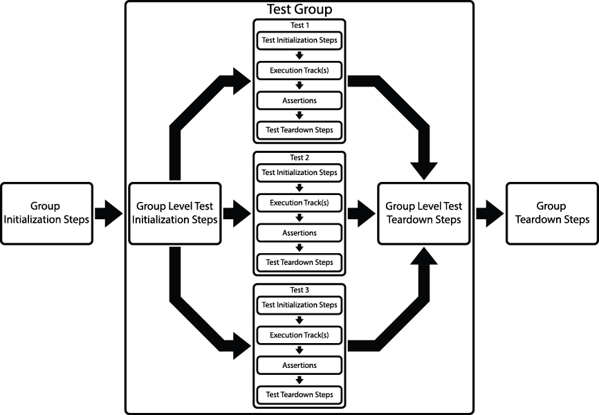



# Test Flow

A LegiTest Project organizes all test elements into four scopes:

- Project - a test project can contain assets and test groups

- Suites - now deprecated, suites can contain assets and multiple groups

- Groups - groups can contain assets, multiple tests and manage the Group and Test Level Initialization as well as the the Group and Test Level Teardown steps.

- Tests - can contain assets and manage the Test Initialization Steps, Execution Tracks, Assertions and Test Teardown Steps.

>  Important Note:
> 
> LegiTest now supports group files being added directly within solution explorer. While existing suites are still supported, individual LegiTest groups offer greater flexibility in use and are the preferred method of building tests.

### Group Execution Flow

### Group Initialization Steps

The Group Initialization executes only once at the beginning the entire test group. This step is the first to run before any tests are actually executed. This step is the first to run before any tests within the group are actually executed. Each group has its own Group Initialization Step. This step configures everything needed to prepare the test environment for the group execution.

### Group Level Test Initialization Steps

This steps executes once at the beginning of every test in the group. It will run right before the actual test begins executing. Each group has its own Group Level Test Initialization step. This step configures everything needed to prepare the test environment before each test execution.

### Test Initialization Steps

This step executes once at the beginning of single test. Each test contains its own Test Initialization step.  This step configures unique elements needed to prepare this test for execution.

### Executions Tracks

Execution Tracks contain the actual elements that compose the test. Each test can hold any number of tracks. By default, the test will execute as many tracks as the test environment can handle. If they wish, users can modified this behavior to only run a set number of tracks at the same time.

### Assertions

Assertions contain test validation that confirms whether a test has passed or failed. Assertions are run immediately after all execution track for the current test has completed. Assertions compares expected data to actual data generated during the execution tracks. The results of these data comparisons will dictate whether the test passes or fails.

### Test Teardown Steps

This step executes once at the end of single test. Each test contains its own Test Teardown step.  This step configures unique elements needed to clean the test environment after test execution.

### Group Level Test Teardown Steps

This steps executes once at the end of every test in the group. It will run right after the actual test finishes executing. Each group has its own Group Level Test Teardown step. This step configures everything needed to clean the test environment after each test completes.

### Group Teardown Steps

The Group Teardown executes only once at the end of the entire test group. This step is the last to run after all tests in the test group have executed. Each group has its own Group Teardown. This step configures everything needed to clean the test environment once group execution completes.