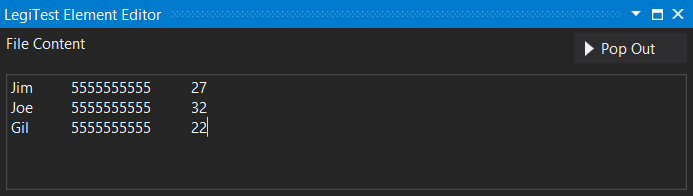
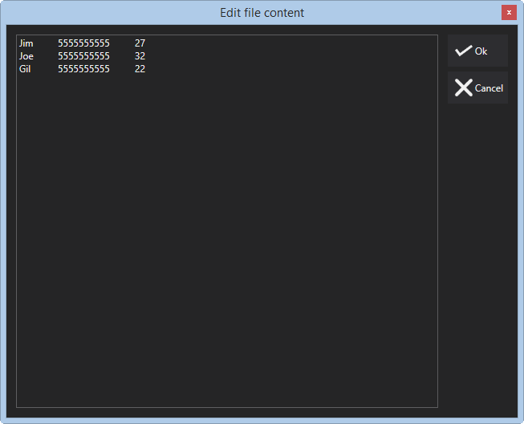



# Text File

The text file assets is used to specify the content of a text file. This asset is used for the File Create action as well as the File Content Comparison assert.

#### Text File Editor

**File Content -** The text to make up the file. Clicking the Pop Out button will provide a larger space to type the content of the file.

#### Pop Out Editor

