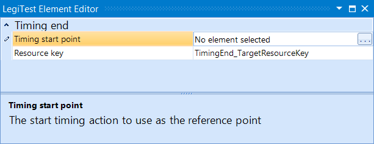



# Timing End

The Timing End action is used along side the Timing Start action. This actions serves as the endpoint for measuring the number of seconds that have elapsed between the start and end.

#### Timing End Editor

**Timing start point -** The starting point to begin timing. This will bring up a list of available Timing Start actions to choose from.

**Resource Key -**  The name given to the number of seconds measured that are stored in the Test Resources.