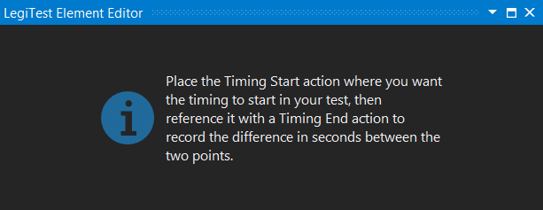



# Timing Start

The Timing Start action is used along side of a Timing End action. When the test hits the Timing Start action, it starts counting the number of seconds elapsed, and once the test hits a Timing End action, the number of seconds are then stored in the Test Resources using the Resource Key specified by the Timing End action.

#### Timing Start Editor

There is nothing to edit for a Timing Start action. The connection of a start to an end is handled in the Timing End action.