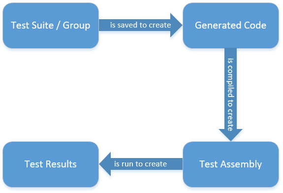
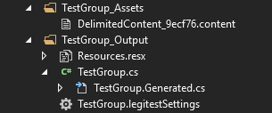



# Understanding the Generated Output

The generated output from LegiTest is C# code, along with some additional files. These files are used as the input to the C# compiler which generates an assembly which contains unit tests. This assembly can then be executed within Visual Studio, within LegiTest Server or by a third party product that supports standard .NET unit tests. This topic aims to clarify the process of moving from a design time test group to a run time assembly.

The process follows the diagram below. When a test suite or group is saved then code is generated. This code is then compiled by the C# compiler into a test assembly. When this assembly is run the tests execute and results for the tests are available. When running within Visual Studio, the test results appear within the Test Explorer window. You can also publish results to LegiTest Server or LegiTest Online - for more information about that integration, please refer to the topic here.

### Generated output

Looking at the output generated by a test group called 'TestGroup' - we might see the following in solution explorer:

There are two main folders, the _Assets folder and the _Output folder.

### _Assets

The _Assets folder contains the content for your assets at design time. So, for example, if we have a [Delimited Content](DelimitedContent.md) asset, then the content file contains the data makes up the delimited content. Most assets are made up of two types of data - there is the metadata (such as a list of output columns and settings) and the data itself. The metadata is usually small, while the data itself can be large. The metadata is stored within the group file - so that when you first open a LegiTest group the asset type can be displayed. The data itself is stored in a separate file so that large amounts of data don't need to be loaded as soon as you open the file.

For more information on the assets available, refer to the '[Assets](Assets.md)' section.

### _Output

The _Output folder contains the code that is generated from your group file, along with some other files. Looking at each one:

- Resources.resx

This file contains the same content as the _Assets folder - but encoded in a way that the C# compiler can understand. This way, the asset content becomes part of the compiled assembly and is available to the tests when they are run.

- TestGroup.cs

This file is the 'user' file. It is usually blank - but code can be added here that integrated with the generated code. You can create methods that are called by the generated test code to perform any action that you want. For more information on adding code to the user topic, see the [topic in the FAQ section](HowCanIAddCustomAssertions.md).

- TestGroup.Generated.cs

This is the main output file. It is where the code that forms the bulk of the tests is stored. Each test, action and assertion will have a method defined within this file.

>  Important Note:
> 
> The generated file is re-created every time you save a LegiTest suite or group. Any changes made directly to the .Generated.cs file are highly likely to be lost.

- TestGroup.legiTestSettings

This file contains the details of any parameters defined. This file is found by the tests at runtime and used in order to control any parameterized elements. For more information on using parameters within tests, refer to the '[Using Parameters](UsingParameters.md)' section.