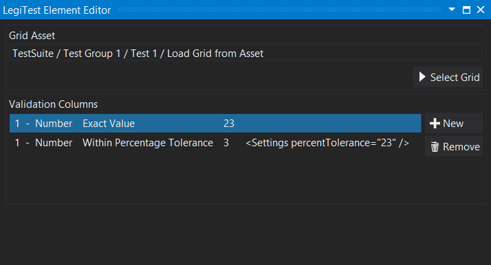
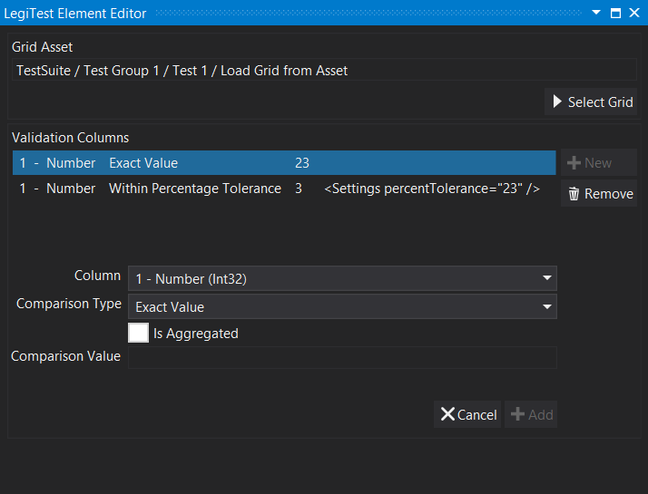



# Validation Manifest

The Validation Manifest allows the user to select a grid, and then add rules to validate the content of the grid. There are different available rules for any given type available in the grid.

#### Validation Manifest Editor

**Select Grid -**  When the editor frist opens, the only available option is the Select Grid button, clicking this will show all available grids in the test in which to validate. Once a grid is selected, then the ability to add validation columns will be available.

If you want to validate the fact that the grid is empty (for example, because your query only returns rows that fail) you can select the 'Only pass validation if no rows are present' option.

**Remove -** clicking remove will delete the selected rule from the manifest.

**New** - Clicking new will expand the editor to show the column selector and comparison type picker.

**Column -** Selects a column from the grid to applu the comparison to.

**Comparison Type -** The available comparison types will vary depending on the type of the selected column. The comparison type will use the Comparison Value field to execute the validation.

**Is Aggregated -** If selected, and the column's type allows for aggregation, then another field will appear to allow the user to select the type of aggregation.

**Comparison Value -** The comparison value is compared to the row of each column using the previoulsy selected Comparison Type.

**Cancel -** Will cancel out of the new comparison wiithout saving.

**Add -** Add will be enabled once all fields are populated for the new rule. Clicking add will save the rule to the Validation Manifest.