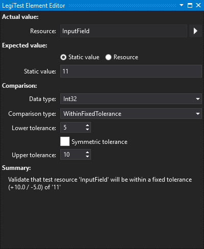
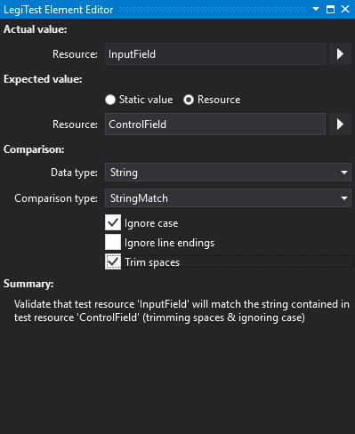



Value Comparison

Value Comparison is a general purpose comparison for comparing two single values. It supersedes both the Integer Comparison and the Scalar Comparison assertions, presenting a simpler configuration while also significantly extending the available options.

#### Value Comparison Editor

There are four main sections to the editor: 'Actual value', 'Expected value', 'Comparison' and 'Summary'.

### Actual Value

This is the value that we want to validate. It always comes from a resource that is available in the test. To select the resource to test, click on the arrow to the right of the resource name box.

### Expected Value

This is the value that we expect the actual value to match. This can either come from a static value that we configure in the user interface or from a resource. If we're using a static value we simply type the value that we want into the static value box. If we're using a resource then we select that option and pick the resource in the same way we did for the actual value.

### Comparison

This section specifies the options that we use for comparison:

Data type: This will be detected automatically when the actual and expected values are entered, but can be changed manually to use a different type for the comparison if necessary.

Comparison type: This is the type of comparison that we want to use, and different types are available for different comparison types. So, for example, 'GreaterThan' is not available for boolean comparisons and 'StringMatch' is not available for integers. Some comparison types have additional configuration options, which are detailed below.

For comparison types 'WithinFixedTolerance' and 'WithinPercentageTolerance' the tolerance options are visible. There is the choice of entering a symmetric tolerance (i.e. same amount of tolerance up and down) or the values for the upper and lower tolerance can be entered specifically. By way of example, in the image above where we are validating within a fixed tolerance of 11 with 5 down and 10 up, values between 6 (11-5) and 21 (11+10) would pass the check.

For comparison types 'StringMatch' and 'RegexMatch', additional string comparison options are available - including whether to ignore case, ignore line endings and trim spaces from the start / end of the values to compare. An example of this is shown in the image below.

### Summary

This section simply provides a plain text description of what has been configured in the assertion editor.