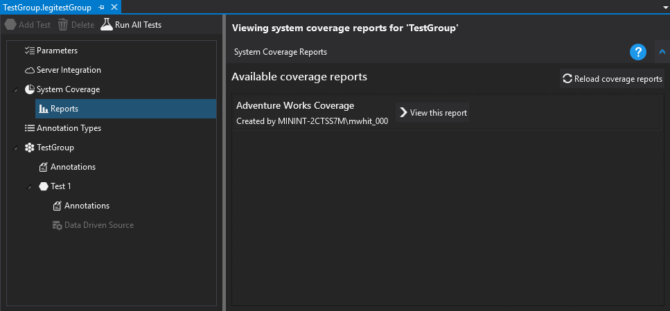
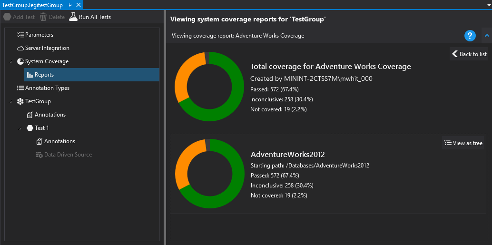
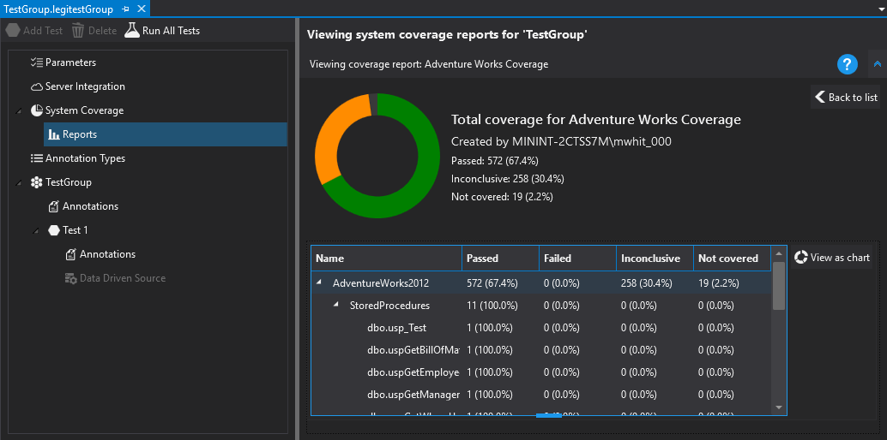



# Viewing Reports

To view system coverage reports from the server in LegiTest Client, we can simply click on the 'Reports' node under System Coverage. This produces a list of the coverage reports that are available on the server:

To view a report, we simply click on the 'View this report' button, and we are shown the graph view which contains a summary graph, and a graph for each coverage report item we have configured:

We can click on 'View as tree' to change the view to a detailed tree view showing all the objects available, and their status:

