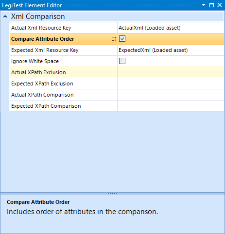



# Xml Comparison

The Xml Comparison Assert allows a user to compare two Xml resources. These resources can be loaded many different ways, such as a from a Load Asset that is loading a File Conent Asset, result of a query, or even from a Get Properties Action. The Xml in the resource is passed in as a string, checked if it is valid Xml then compared to the other resource.

#### Xml Comparison Editor

**Actual Xml Resource Key -** This is the resource key for the key holding the Xml to be used to compare.

**Compare Attribute Order -** When in enabled, the comparison will first compare the order of attributes in an element, before comparing the content. If left disabled, attribute order will not be compared, only attribute value.

**Expected Xml Resource Key -** This is the resource key for the key holding the Xml to be compares against.

**Ignore White Space -** When enabled, this will ignore any extra spaces or white spaces in or around elements.

**Actual XPath Exclusion -** This field takes an XPath string, the XPath will be executed against the Actual Xml once loaded, and elements found by the XPath will be excluded from the comparison on the Actual side only. This field can be a | "pipe" delimited string, allowing for multiple XPath items to be executed.

**Expected XPath Exclusion -** This field takes an XPath string, the XPath will be executed against the Expected Xml once loaded, and elements found by the XPath will be excluded from the comparison on the Expected side only. This field can be a | "pipe" delimited string, allowing for multiple XPath items to be executed.

**Actual XPath Comparison -** This field takes an XPath string, the XPath will be executed against the Actual Xml once loaded. Only the elements found by the XPath will be used in the comparison for the Actual side only.

**Expected XPath Comparison -** This field takes an XPath string, the XPath will be executed against the Expected Xml once loaded. Only the elements found by the XPath will be used in the comparison for the Expected side only.