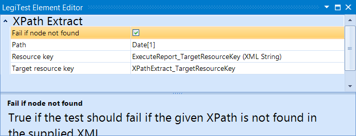



# XPath Extract

The XPath Extract action is used with an Execute Report action to extract information from the report. The user will select the resource key of the report that was previously executed, and then supply the xpath of the information they want to retrieve. The information extracted is then stored in another resource key that can then be used with one of the assert actions to verify the validity of the data. If multiple nodes are matched, then only the value of the first will be returned. If no information is found at the node that the path is directed to, then the user can specify if the test should fail or continue.

#### XPath Extract Editor

**Fail if node not found -** This allows the user to specify whether or not to fail the test if a node can not be found.

**Path -** The XPath to apply to the XML to retrieve the value.

**Resource Key -** The resource key of the XML.

Target Resource Key - The resource key to store the extracted value.