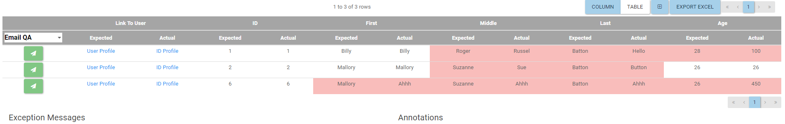

# Actions

Actions work similarly to Notifications, with the key difference being that they are manually executed on the Assert Details page. They share the same targets and can use any custom template, but it is recommended to use the Actions template as it is configured for the Action schema.

On the actions page, users will be able to see all of the already created action. From here those actions can be edited or deleted, or a user can add a new one by clicking the green plus button on the top right of the table.

### Creating an Action

To get started creating an action, click the green plus button on the action table. Once on the next page, give the action a name. You can also view the schema for an Action here by clicking View Action Schema.

Once named, select the target you wish to use. In this example, we selected a previously configured custom target. After selecting the target, then select the template to use. Again, it is recommended to use the LegiTest Action template, as it is already configured to make use of the Action Schema.

Once configured, you can test the action before saving it or just save it without testing. Multiple targets can also be attached to a single action. 

### Using an Action

Now that there is an action set up, we can see hw to execute one. To execute an action will we need to visit the assert details page for either a Grid Comparison or a Grid Validation.

On the Assert Details page, you will not notice a new column added to the grid comparison or grid validation results. This is the action column, at the top you can select the drop down and select any action that has been created.
Once an action is selected, you can then click the send button for the row you wish to take action on. In this example, I have selected the Email QA action, clicking send on the first row, will use only that row's data to populate the
action template and send the email to the QA team for further review. 