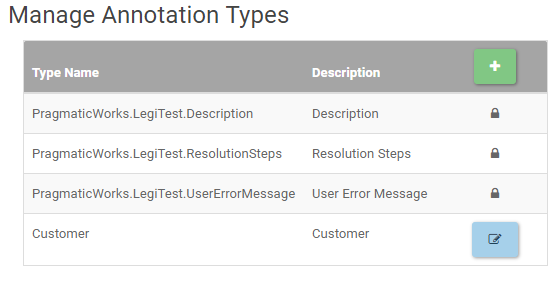

# Manage Annotation Types

Annotation types can be added if the default ones do not fit the user's needs. To do so, visit the Manage Annotation Types page from the System Settings drop down.
From here, the user will see the three default annotations with locks on them. These can not be edited or removed. To add a new one, click the green plus button at the top right.

Once an annotation type is added, a user will be able to edit them by clicking the edit icon on the line for the annotation. The new types can be synced with LegiTest client for immediate use in developing new tests. 