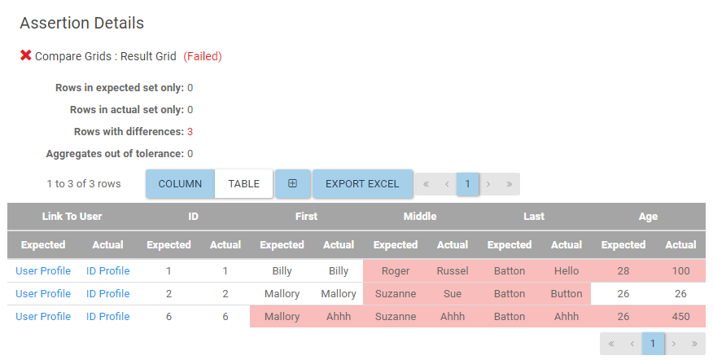

# Assertion Details

The assertion details page will give information on the selected assert. If the assert passed, the information will be limited, as no errors were present.
However, if the assert failed, there will be a lot more information available, that will change depending on the assert. Validation grids asserts will show a validation
grid with the failed rows. A Grid Comparison assertion will show a grid with the failed row comparisons, with the bad column in each row highlighted in red. Grids will allow
the user to export the results to an excel file by clicking the export excel button.

Every failed assertion will allow the user to expand the Exception Message portion to see the stack trace of the failure. This message is the same that would appear in the Visual Studio test runner.

## Validation Grid

## Grid Comparison
