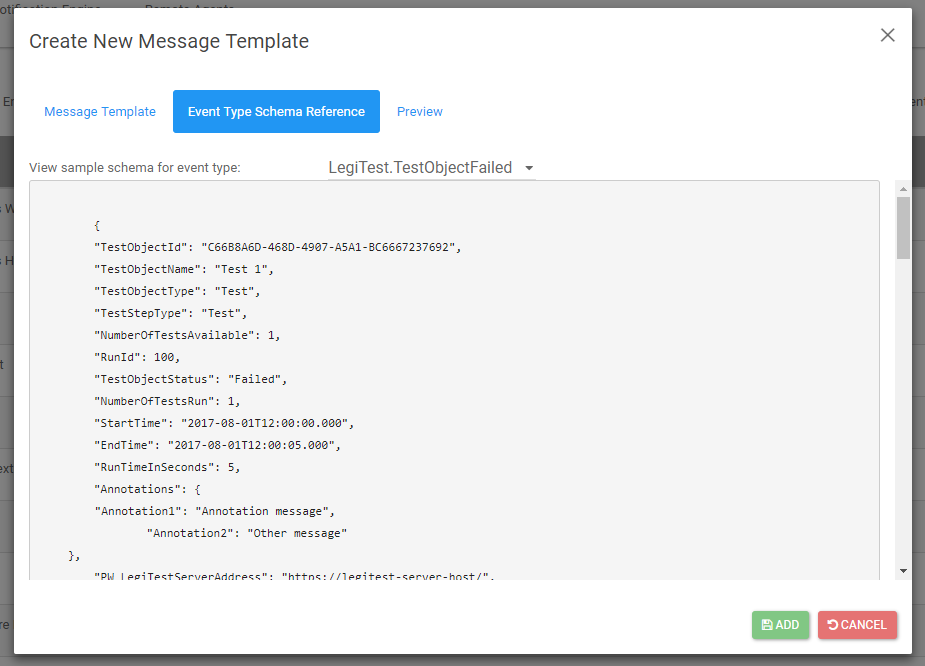

# Custom Template Example

The following is example HTML used for a custom template:

### Raw HTML
```                                       
<style>                                   
table {                                   
    font-family: arial, sans-serif;       
    border-collapse: collapse;            
    width: 100%;                          
}                                         
td, th {                                  
    border: 1px solid #dddddd;            
    text-align: left;                     
    padding: 8px;                         
}                                         
tr:nth-child(even) {                      
    background-color: #dddddd;            
}                                         
</style>                                  
                                          
<table>                                   
    <thead>                               
        <tr>                              
            <th>Property Name</th>        
            <th>Property Value</th>       
        </tr>                             
    </thead>                              
    <tbody>                               
        <tr>                              
            <td>Test Object Id</td>       
            <td>{{TestObjectId}}</td>     
        </tr>                             
        <tr>                              
            <td>Test Object Name</td>     
            <td>{{TestObjectName}}</td>   
        </tr>                             
        <tr>                              
            <td>Run Time</td>             
            <td>{{RunTimeInSeconds}}</td> 
        </tr>                             
    </tbody>                              
</table>                                  
```                                            

### Rendered HTML
     
<style>                                   
table {                                   
    font-family: arial, sans-serif;       
    border-collapse: collapse;            
    width: 100%;                          
}                                         
td, th {                                  
    border: 1px solid #dddddd;            
    text-align: left;                     
    padding: 8px;                         
}                                         
tr:nth-child(even) {                      
    background-color: #dddddd;            
}                                         
</style>                                  
                                          
<table>                                   
    <thead>                               
        <tr>                              
            <th>Property Name</th>        
            <th>Property Value</th>       
        </tr>                             
    </thead>                              
    <tbody>                               
        <tr>                              
            <td>Test Object Id</td>       
            <td>C66B8A6D-468D-4907-A5A1-BC6667237692</td>     
        </tr>                             
        <tr>                              
            <td>Test Object Name</td>     
            <td>Test 1</td>   
        </tr>                             
        <tr>                              
            <td>Run Time In Seconds</td>             
            <td>5</td> 
        </tr>                             
    </tbody>                              
</table>               

### {{Syntax}}

In the above HTML, you will noticed that for the property value of each item we reference it as such {{TestObjectId}}. This syntax tells the notification engine to insert the value of that parameter into the notification. An entire list of availabl data can be seen 
on the event schema tab when editing a template. There are currently 3 different schemas each with varying available data.



The syntax used can be highly customizable, visit the [Advanced Syntax](advancedSyntax.md) page for more information.                   