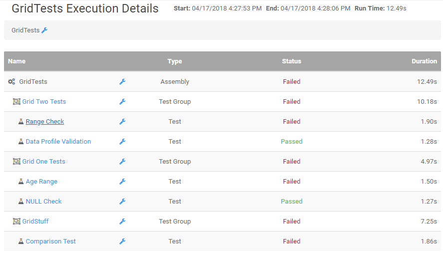
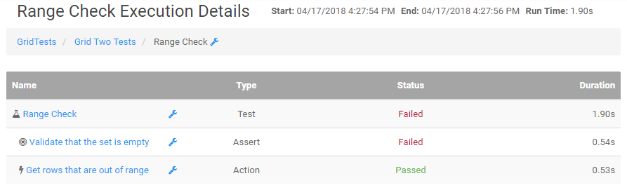

# Execution Details

The Execution Details page will display all items that were part of the selected execution. When viewed at the assembly level
it will show all groups and tests. When viewed at a group level, it will show all tests under that group.

The major difference comes when viewing the details page at the test level. Clicking any test from the group or assembly view will produce the Execution Details page
for the test level. At the test level, the details page will list all actions and asserts performed during the test. Clicking these items will allow the user to see
the [Assertion Details](assertionDetails.md) page for that single item. This will show why an action or assert may have failed along with more information. 

